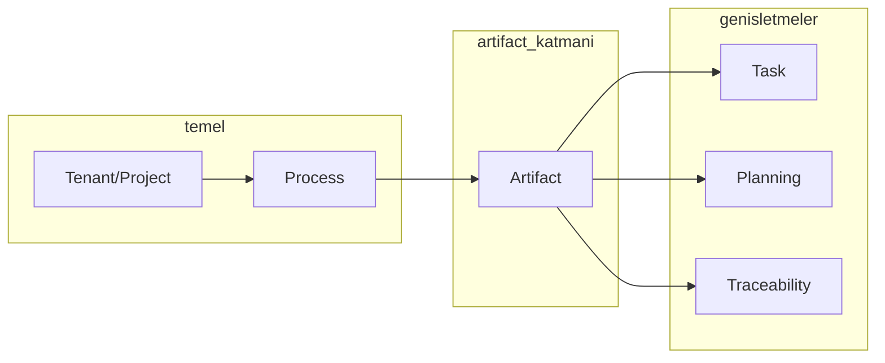

# Context'ler ve İlerleyiş — ALM DevOps Platform

**Hedef:** Manifest DSL, metadata ve meta-metadata driven ALM/DevOps platformunda **hangi context'lerle çalışacağımız** ve **nasıl ilerleyeceğimiz**.

**Bu doküman kimlere hitap eder:** Ürün/teknik liderler (önce hangi context, hangi sıra), geliştiriciler (hangi manifest/metadata nerede kullanılır), yeni katılanlar (bounded context haritası).

---

## 1. Çalışacağımız Context'ler

Platform **bounded context**'lere göre bölünür. Her context’in davranışı mümkün olduğunca **manifest / metadata** ile tanımlanır.

| Context | Kısa açıklama | Manifest / metadata kaynağı |
|--------|----------------|-----------------------------|
| **Process** | Süreç tanımı: workflow, artifact tipleri, geçişler | Manifest DSL (`workflows`, `artifact_types`); process template YAML/JSON |
| **Artifact** | İş öğeleri (requirement, defect, story, epic) | Manifest’teki `artifact_types` + opsiyonel `artifact_types[].fields` (meta-metadata) |
| **Tenant / Project** | Kiracı, organizasyon, proje, üyelik | Config / RBAC metadata; manifest proje bazlı |
| **Task** | Artifact’a bağlı görevler | Manifest’teki task workflow; form/list schema (meta-metadata) |
| **Planning** | Cycle/iteration, area, baseline, release | Manifest veya ayrı planning config; alan/iterasyon path metadata |
| **Traceability** | Artifact bağları (parent/child, related, covers) | Link type'lar manifest veya metadata ile tanımlı |
| **Board** | Kanban (state kolonları, type/cycle filtre) | Workflow states manifest'ten |

**Öncelik sırası (aşağıda “Nasıl ilerleyeceğiz” buna göre):**  
Process → Artifact → Tenant/Project (zaten var) → Task → Planning → Traceability → Board.

### Context bağımlılıkları (özet)



Process, Tenant/Project’e dayanır; Artifact, Process’e; Task / Planning / Traceability ise Artifact’a bağlıdır.

---

## 2. Manifest DSL ve Meta-Metadata Nerede Kullanılır?

- **Manifest DSL:** Süreç davranışının tek deklaratif kaynağı.  
  - `workflows`: state’ler, category’ler, transitions.  
  - `artifact_types`: tip adı, hangi workflow.  
  - İleride: `artifact_types[].fields` (custom alanlar) → **meta-metadata**: form/list schema buradan türetilir.

- **Metadata-driven:**  
  - Form schema: artifact/task form alanları manifest’ten (veya manifest’e bağlı metadata’dan) gelir.  
  - List schema: kolonlar, filtreler manifest/artifact_types ile uyumlu.

- **Meta-metadata:**  
  - “Hangi artifact tipinde hangi alanlar var” bilgisi manifest veya ayrı metadata dosyasında; form/list schema ve validasyon buradan türetilir. Kod değişmeden yeni tip/alan eklenir.  
  - Örnek (ileride): `artifact_types[].fields` ile custom kolon ve form alanları:

```json
"artifact_types": [
  {
    "id": "requirement",
    "name": "Requirement",
    "workflow_id": "basic",
    "fields": [
      { "id": "priority", "name": "Priority", "type": "string", "enum": ["low", "medium", "high"] },
      { "id": "effort", "name": "Effort", "type": "number" }
    ]
  }
]
```

Bu sayede ALM DevOps platformu: süreç ve ekran davranışını **manifest + metadata** ile yönetir; kod daha çok altyapı ve kurallar (validation, API, event) tarafında kalır.

---

## 3. Nasıl İlerleyeceğiz?

Aşamalar **manifest’i merkeze alarak** ve her context’te **metadata/meta-metadata** kullanımını artırarak ilerler.

### Faz 0 — Temel (Mevcut)

- **Process:** Manifest okunuyor; workflows + artifact_types mevcut.  
- **Artifact:** CRUD, state transition; form/list schema manifest’ten.  
- **Tenant/Project:** Var; auth, proje seçimi.

Bu aşamada context’ler: **Process, Artifact, Tenant/Project**. İlerleyiş: Manifest’i tek gerçek kaynak yapmak (edit/kaydet, A1) ve list’i artifact_types/fields ile zenginleştirmek (A3).

---

### Adım 1 — Process context’i sağlamlaştır (Manifest DSL)

- Manifest’i **tek kaynak** yap: UI’dan düzenleme + kaydetme (Faz A1).  
- Gerekirse YAML modu (Faz A2).  
- Tüm artifact type’lar ve workflow’lar manifest’ten okunur; backend/frontend manifest’e göre davranır.

**Çıktı:** Process context tamamen Manifest DSL ile yönetiliyor.  
**Tamamlanma kriteri:** Manifest sayfasından düzenleyip kaydedebilme; list/form schema’nın güncel manifest’ten gelmesi.

---

### Adım 2 — Artifact context’i meta-metadata ile derinleştir

- List schema: `artifact_types[].fields` (veya eşdeğer metadata) ile **custom kolonlar** (Faz A3).  
- Form schema: artifact form alanları manifest/metadata’dan; yeni alan = manifest/metadata güncellemesi.  
- İleride: artifact’a `businessId`, effort, roll-up vb. manifest/metadata’da tanımlı alanlar eklenir.

**Çıktı:** Artifact context, form/list schema meta-metadata driven.  
**Tamamlanma kriteri:** Manifest’e `fields` ekleyince listede ve formda ilgili kolon/alanın görünmesi; kod değişikliği gerekmemesi.

---

### Adım 3 — Task context

- Task entity + API (Faz B2–B3); artifact’a bağlı.  
- Task’ın state’leri ve (varsa) alanları **manifest’teki task workflow / task metadata** ile tanımlı.  
- Form/list schema: task için de manifest veya metadata’dan türetilir (meta-metadata).

**Çıktı:** Task context manifest/metadata ile; generic task endpoint’leri type/metadata’ya göre davranır.

---

### Adım 4 — Planning context

- Cycle/iteration, area, baseline, release kavramları.  
- Hangi alanların (area path, iteration path vb.) hangi entity’lerde olduğu **manifest veya planning metadata** ile tanımlı.  
- List/board görünümleri bu metadata’ya göre (filtre, gruplama).

**Çıktı:** Planning context metadata-driven; cycle/iteration/area manifest veya config ile genişletilebilir.

---

### Adım 5 — Traceability context

- Artifact link tipleri (parent/child, related, covers, validates) **manifest veya link-type metadata** ile.  
- API ve UI bu tanıma göre link oluşturma/listeleme.

**Çıktı:** Traceability context manifest/metadata ile; yeni link tipi kod değişmeden eklenebilir.

---

## 4. Özet Tablo: Context → Faz / Görev Referansı

| Context | İlk tam kapsam (REMAINING_PLAN ref) | Manifest / metadata kullanımı |
|---------|-------------------------------------|-------------------------------|
| Process | Faz A: A1 (edit+kaydet), A2 (YAML) | Manifest DSL: workflows, artifact_types |
| Artifact | Faz A: A3 (custom kolonlar); Faz B | artifact_types + fields → form/list schema (meta-metadata) |
| Tenant/Project | Mevcut | Config, RBAC |
| Task | Faz B: B2 (entity+API), B3 (Linked Tasks paneli) | Task workflow + task form/list schema (meta-metadata) |
| Planning | Faz D: D4 (Cycle, Area, Cycle backlog; Planning'den atama) | Planning metadata; cycle/area |
| Traceability | ArtifactLink entity, API, Links paneli | Link type metadata |
| Board | Kanban sayfası (type + cycle filtresi, sürükle-bırak) | Workflow states manifest'ten |

Detaylı görev listesi için [REMAINING_PLAN.md](./REMAINING_PLAN.md) kullanılır. Güncel tamamlananlar: Faz A–B, D4 (Planning, Cycle backlog), Traceability (Links), Board (Kanban, type + cycle filtresi).

---

## 5. İlk Adım Önerisi (Sıralı)

1. **Process:** [A1] Manifest edit + kaydet ile Process context’i Manifest DSL’e tam bağla; istenirse [A2] YAML modu.  
2. **Artifact:** [A3] List schema’da custom kolonları `artifact_types[].fields` (veya eşdeğer metadata)’dan al; Artifact context’i meta-metadata driven yap.  
3. **Task:** [B2] Task entity + API, [B3] Artifact detayda Linked Tasks paneli; task form/list schema’yı manifest/metadata’dan türetmeyi planla.

Bundan sonra sırayla: Planning (D4 cycle/area/baseline/release), Traceability (link’ler) — hepsi manifest/metadata/meta-metadata ile genişletilebilir şekilde.

**Not (manifest versiyonu):** Manifest değiştiğinde mevcut artifact’ların hangi workflow/state set’i ile yorumlanacağı (o anki manifest vs. artifact oluşturulduğu andaki snapshot) ileride versiyonlama ile netleştirilebilir.

---

**İlgili dokümanlar:**

- [manifest-dsl.md](./manifest-dsl.md) — DSL grammar ve semantik
- [manifest-schema.md](./manifest-schema.md) — JSON/yapı
- [REMAINING_PLAN.md](./REMAINING_PLAN.md) — Faz A–E görevleri
- [GAP_ANALYSIS_ALM.md](./GAP_ANALYSIS_ALM.md) — Gap analizi (mevcut vs hedef)
- [BOARD_CONTEXT.md](./BOARD_CONTEXT.md) — Board context taslağı (Kanban/Scrum)
- [alm-app.md §12](./alm-app.md#12-asama-plani-phases) — Phase 1–12

— ↑ [Dokümanlar](README.md)
