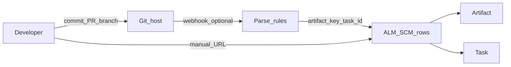

# Plan — SCM / Kaynak Kod İzlenebilirliği (Traceability)

Bu doküman, ALM’de **artifact ↔ Git (commit, branch, PR/MR)** ilişkisini ürün seviyesinde nasıl kuracağımızı tanımlar. Mevcut durum: [GAP_ANALYSIS_ALM.md](./GAP_ANALYSIS_ALM.md) (Traceability satırı); ilişkili özellikler: **ArtifactLink**, manifest **LinkType**; alt iş öğeleri için **Task** ([Task entity](../backend/src/alm/task/domain/entities.py) — her task bir `artifact_id` ile bağlı).

**Hedef:** Geliştirici ve PM’in aynı “tek cam” üzerinden iş kalemi ile kod değişikliğini görmesi; ileride CI/CD ve dağıtım durumu ile birleştirilebilir.

**Uygulama durumu (S1):** `scm_links` tablosu, API (`GET/POST/DELETE …/artifacts/{id}/scm-links`), isteğe bağlı **`task_id`** (liste sorgusu `task_id`, oluşturma gövdesi; backlog’da görev odaklı filtre — `ArtifactDetailSource`), backlog / bağımsız artifact detayında **Kaynak / Source** sekmesi ve GitHub/GitLab PR–commit URL parse ([migration 048](../backend/migrations/versions/048_add_scm_links.py), modül `alm.scm`). Kayıtlı `web_url` için fragment/query ve sondaki `/` kaldırılarak tekilleştirilir (`canonical_web_url`). Proje **GET/PATCH** yanıtlarında `scm_*_webhook_secret` değerleri dönmez; yalnızca `scm_webhook_*_secret_configured` bayrakları (`public_settings` / `project_dto_to_response`). Entegrasyon testleri: [`test_scm_links.py`](../backend/tests/test_scm_links.py).

**S2 (tamamlandı):** `POST …/scm-links/parse-preview` ile URL önizlemesi; **`web_url` + `context_text` birlikte** `artifact_key` ipucu metni olarak işlenir ([`preview_scm_url.py`](../backend/src/alm/scm/application/queries/preview_scm_url.py)). Heuristikler: `KEY-NNN` token’ları, Conventional `feat(KEY):`, dal adı `feature/key-n`, **`Story:` / `Implements:`** footer satırları ([`artifact_key_hints.py`](../backend/src/alm/scm/application/artifact_key_hints.py), [`test_artifact_key_hints.py`](../backend/tests/unit/scm/test_artifact_key_hints.py)). Projede **büyük/küçük harf duyarsız** eşleme (`list_by_project_and_artifact_keys`); **çift kayıt uyarısı** (`duplicate_kind` / `duplicate_link_id`). **S1+:** önizleme sonrası alan, sunucunun `canonical_web_url` değeriyle (query/fragment/`/` temizliği) **otomatik hizalanır** ([`ArtifactDetailSource.tsx`](../frontend/src/features/artifacts/components/ArtifactDetailSource.tsx)). UI’de Kaynak sekmesinde blur önizlemesi.

**S3 (webhook — MVP):** JWT yok. **GitHub:** `POST …/projects/{project_id}/webhooks/github` — ham gövde üzerinden `X-Hub-Signature-256` (HMAC-SHA256); **`settings.scm_github_webhook_secret`**. `pull_request` (`opened` / `reopened` / `synchronize` / `closed` + `merged`); `push` (`refs/heads/*`, `distinct` commit’ler, başına **32** üst sınır) → dal + commit mesajı ile eşleme, commit URL + `commit_sha`; yanıt `created` / `duplicate` / `no_match` sayaçları; `ping` → `{"status":"ok"}`. **GitLab:** `POST …/webhooks/gitlab` — **`settings.scm_gitlab_webhook_secret`**; `Merge Request Hook` + `push` (`Push Hook`, `object_kind: push`, aynı commit üst sınırı). MR aksiyonları: `open` / `reopen` / `update` / `merge`; `close` yalnızca `state: merged`. Ortak yardımcılar: [`scm_webhook_support.py`](../backend/src/alm/orgs/api/scm_webhook_support.py). **İsteğe bağlı politika:** [`scm_webhook_policy.py`](../backend/src/alm/orgs/api/scm_webhook_policy.py) — `scm_webhook_github_enabled` / `scm_webhook_gitlab_enabled` (`false` → `reason: disabled`); `scm_webhook_push_branch_regex` (yalnızca push, `re.search`; geçersiz regex fail-open). Entegrasyon: `test_scm_links` içinde `processing_disabled`, `branch_policy`, `branch_policy_allow` senaryoları. `CreateScmLink` (`source=webhook`, `created_by=null`). PR/MR başlık+açıklama ve push commit mesajında **`Refs:`**, **`Task-ID:`** veya **`Task:`** trailer satırlarından UUID’ler (virgülle çoklu, belge sırası) okunur; UUID yalnızca aynı projede ve **aynı artifact** altındaki bir task ise `task_id` atanır ([`task_ref_trailers.py`](../backend/src/alm/scm/application/task_ref_trailers.py)). Kod: [`routes_github_webhook.py`](../backend/src/alm/orgs/api/routes_github_webhook.py), [`routes_gitlab_webhook.py`](../backend/src/alm/orgs/api/routes_gitlab_webhook.py). Ham gövde **1 MiB** üst sınırı (`SCM_WEBHOOK_MAX_BODY_BYTES` → **413**). **Teslimat idempotency:** GitHub `X-GitHub-Delivery`, GitLab `X-Gitlab-Event-UUID` (normalize, max 128); terminal **200** sonrası [`051`](../backend/migrations/versions/051_scm_webhook_processed_deliveries.py) tablosunda kayıt — aynı teslimatın tekrarı `{"status":"ignored","reason":"duplicate_delivery"}`; başlık yoksa yalnızca mevcut `duplicate` link kuralları geçerli. **Unmatched kuyruk (MVP):** tablo `scm_webhook_unmatched_events` ([049](../backend/migrations/versions/049_add_scm_webhook_unmatched_events.py), dismiss alanları [050](../backend/migrations/versions/050_scm_webhook_unmatched_dismiss.py)); PR/MR `no_match` ve push’ta eşleşmeyen commit’ler (teslimat başına en fazla **20** satır, kısaltılmış `context`); `GET …/webhooks/unmatched-events` (`project:read`, sorgu `triage=open|dismissed|all`); `POST …/unmatched-events/{id}/dismiss` ve `…/undismiss` (`project:update`) — [`routes_scm_webhook_unmatched.py`](../backend/src/alm/orgs/api/routes_scm_webhook_unmatched.py). UI: proje detayında **Include dismissed** ve satır triage; **Git webhooks** kartı (`projectScmWebhooks` i18n, EN/TR), teslimat politikası (duraklatma + push dal regex), gövde boyutu / teslimat idempotency (`X-GitHub-Delivery` / `X-Gitlab-Event-UUID`) açıklaması ve `Refs:` ipucu ([`ProjectScmWebhooksCard.tsx`](../frontend/src/features/projects/components/ProjectScmWebhooksCard.tsx)). OpenAPI (`/docs`): artifact **SCM links** CRUD/parse-preview, provider webhook’ları ve unmatched uçları ortak **SCM webhooks** etiketi altında; GitHub/GitLab webhook işlemlerinde imza/olay/teslimat başlıkları şemada isteğe bağlı parametre olarak listelenir (`Header()`).

---

## 1. Problem ve kapsam

| Sorun | Sonuç |
|--------|--------|
| PR/commit bilgisi yalnızca sohbet veya manuel URL ile taşınıyor | Planlama ile kod arasında kopukluk |
| Mevcut **ArtifactLink** yalnızca artifact→artifact | Harici SCM kimliği (repo, SHA, PR numarası) birinci sınıf değil |
| Kalite/regülasyon tarafı “hangi değişiklik bu gereksinimi karşıladı?” sorusuna sistematik cevap üretemiyor | Audit zayıf |

**Kapsam dışı (bu fazda):** Tam Git hosting clone/import; derin kod arama; otomatik merge/branch yönetimi.

---

## 2. İlkeler

1. **Tenant izolasyonu:** Tüm SCM bağlantıları `project_id` (ve gerekirse org) altında; başka projeden veri sızması olmamalı.
2. **Opsiyonel otomasyon, zorunlu manuel yol:** Webhook’lar “nice to have”; en azından API + UI ile PR URL’si veya SHA eklenmeli.
3. **Provider soyutlama:** Ortak alanlar (provider, repo_full_name, ref, sha, pull_request_number, web_url); GitHub ve GitLab aynı modelde.
4. **Task hattı:** SCM satırı her zaman bir **artifact** ile ilişkilidir; geliştirici alt görevi netleştirmek istiyorsa isteğe bağlı **`task_id`** doldurulur (Task zaten `artifact_id` üzerinden üst iş öğesine bağlıdır).

---

## 3. Endüstri pratikleri ve ALM eşlemesi

Sektörde yaygın kalıplar ALM’de **parse kuralları, şablonlar ve webhook eşlemesi** ile karşılanır; Git provider’daki `#issue` otomatik linkleri ALM `artifact_key` ile birebir aynı semantikte olmayabilir.

| Kaynak | Pratik | ALM karşılığı |
|--------|--------|----------------|
| [Conventional Commits](https://www.conventionalcommits.org/en/v1.0.0/) | `type(scope): subject` + isteğe bağlı gövde + **footer** (git trailer) | `scope` veya footer’da **`artifact_key`**; isteğe bağlı `Refs: <task_uuid>` veya ileride **`task_key`** |
| [GitHub — PR ↔ issue](https://docs.github.com/en/issues/tracking-your-work-with-issues/linking-a-pull-request-to-an-issue) | `Closes` / `Fixes` / `Resolves` + `#num` veya `owner/repo#num` | PR açıklamasında aynı anahtar sözleşmesi metin olarak; webhook/parser **`artifact_key`** çözer |
| GitHub (kurumsal) | [Autolink references](https://docs.github.com/en/repositories/managing-your-repositorys-settings-and-features/managing-repository-settings/configuring-autolinks-to-reference-external-resources) ile `PREFIX-123` → URL | Repo tarafında ALM artifact URL’sine autolink; ALM tarafında ters yönde SCM satırı |
| [GitLab — crosslinking](https://docs.gitlab.com/user/project/issues/crosslinking_issues) | `Ref #id`, `Closes #id`, `PREFIX-123:` commit konusu, tam GitLab URL | Parser’da branch / başlık / footer ile aynı **öncelik sırası** (§4 Faz S3) |

**Uyumluluk çerçevesi:** PR odaklı uçtan uca izlenebilirlik anlatımı için örnek çerçeve: [GitHub Blog — traceability with pull requests](https://github.blog/enterprise-software/governance-and-compliance/demonstrating-end-to-end-traceability-with-pull-requests).

### Geliştirici şablonu (tek kaynak)

Ekip içi dokümanda şunlar sabitlenir (UI’de ALM’den kopyalanabilir alanlarla desteklenir):

- **Branch:** `feature/<artifact_key>-kisa-aciklama` (örn. `feature/REQ-42-api-validation`).
- **Commit (Conventional Commits uyumlu):** `feat(REQ-42): kısa açıklama` ve gerekiyorsa footer `Refs: <task_uuid>` veya ileride `Task: T-7`.
- **PR açıklaması:** İlk satırda `artifact_key`; alt iş için task referansı; varsa ALM artifact URL’si.

**İsteğe bağlı süreç (ürün dışı):** CI’da merge öncesi yumuşak gate — örn. dal adında veya son commit/PR gövdesinde en az bir geçerli `artifact_key` regex’i; ihlalde uyarı veya gönüllü onay.

---

## 4. Önerilen evrim (fazlar)

### Faz S1 — MVP (manuel + API)

- **Veri:** `scm_link` veya `external_code_reference` benzeri tablo veya artifact üzerinde JSONB koleksiyon (tercihen ayrı tablo: sorgu ve indeks için).
  - Önerilen alanlar: `project_id`, `artifact_id`, **`task_id`** (nullable FK → `tasks`, bu commit/PR özellikle bir breakdown task içinse), `provider` (`github` | `gitlab` | `other`), `repo_full_name`, `ref` (branch/tag, opsiyonel), `commit_sha` (kısa/uzun normalize), `pull_request_number` (opsiyonel), `title` (snapshot), `web_url`, **`source`** (`manual` | `webhook` | `ci`), `created_by`, `created_at`.
  - **Semantik:** `task_id` boş → artifact genelinde kod değişikliği; dolu → aynı zamanda belirli bir Task satırına bağlı görünürlük (UI: backlog’da ağaçtan görev odaklandığında Kaynak sekmesi API `task_id` ile filtrelenir; “tüm bağlantılar”a geçiş mümkün).
- **API:** CRUD (liste artifact’a göre, oluşturma, silme); `artifact:update` izni ile hizalı. İsteğe bağlı gövde alanı **`source`:** `manual` (varsayılan) veya **`ci`** — pipeline’ın aynı uçtan link yazması için; `webhook` yalnızca sağlayıcı webhook’undan set edilir.
- **UI:** Artifact detayda “Source / SCM” paneli: link listesi, “Add link” (alan formu). Task odaklı görünümde ilgili SCM alt kümesi. Görev satırında **webhook için `Refs:` trailer satırını** (tam biçimde) kopyala — [`ArtifactDetailTasks.tsx`](../frontend/src/features/artifacts/components/ArtifactDetailTasks.tsx).

**S1+ (MVP’ye yakın, düşük sürtünme):** “Add link” akışında yapıştırılan PR/commit URL’si sunucuda [`CreateScmLink`](../backend/src/alm/scm/application/commands/create_scm_link.py) ile `owner/repo`, PR #, SHA ve başlığa çözülür; önizleme sonrası UI, **`canonical_web_url`** ile alanı hizalar (giriş **S2** özeti).

**Kabul:** Bir story’ye en az bir PR URL’si veya commit SHA kaydedilir; listede tıklanınca provider web’e gider.

### Faz S2 — URL / açıklama metni zenginleştirme

- **Durum:** Uygulandı (bkz. giriş **S2** özeti). URL’den `owner/repo`, PR #, commit parse; `web_url` ile `context_text` birleşik ipucu metni; `Story:` / `Implements:` footer’ları; çift kayıt önizleme ve DB kısıtı.

### Faz S3 — Webhook entagrasyonu (otomasyon)

- **GitHub:** PR `closed` + `merged`, `push` (branch filter ile) → imza doğrulamalı endpoint.
- **GitLab:** Merge push/MR merged webhook benzeri.
- **Eşleme stratejisi (konfigüre edilebilir):** PR başlığı / açıklamasında artifact key; branch adı (`feature/KEY-42-…`); commit mesajı footer (`Refs: <uuid>`, `Story: KEY-42`, vb.).
- **Deterministik öncelik sırası (uygulama = [`artifact_for_pr_fields`](../backend/src/alm/orgs/api/scm_webhook_support.py)):** Metin parçaları sırayla taranır: **(1) dal adı (`head_ref`)** → **(2) başlık (`title`)** → **(3) gövde (`body_text`)**. PR/MR webhook’larında `title` = PR başlığı, `body_text` = PR açıklaması. **Push** webhook’unda tam commit mesajı tek parça olarak `title`’a verilir (konu + gövde + footer birlikte); `body_text` boştur — böylece dal önce, ardından mesajın tamamı işlenir. Her parça için `extract_artifact_key_hints` ile üretilen ipuçları **sırayla** denenir; veritabanında bulunan **ilk** `artifact_key` eşleşmesi kazanır (aynı PR’da birden fazla geçerli key ipucu varsa, hint listesinde önce gelen önceliklidir).
- **Başarısız eşleme:** **Tercih:** “unmatched webhook” için operasyonel **liste/kuyruk** (triage UI veya yönetim API’si); yalnızca log üretmek düşük görünürlük riski taşır. **MVP:** `scm_webhook_unmatched_events` + liste (`triage` filtresi) + dismiss/undismiss; proje detayında **Git webhooks** kartı (URL kopyalama, **secret/token** kaydı ve kaldırma, unmatched tablo ve triage — [`ProjectScmWebhooksCard.tsx`](../frontend/src/features/projects/components/ProjectScmWebhooksCard.tsx)).

### Faz S4 — Deploy × SCM (kısmen üründe)

Ayrıntılı epik ve S4b: **[PLAN_SCM_S4_DEPLOY_TRACEABILITY.md](./PLAN_SCM_S4_DEPLOY_TRACEABILITY.md)**.

- **S4a (kısmi teslim):** [`deployment_events`](../backend/migrations/versions/052_deployment_events.py) tablosu; **`POST/GET …/projects/{project_id}/deployment-events`** (`project:update` / `project:read`) — [`routes_deployment_events.py`](../backend/src/alm/orgs/api/routes_deployment_events.py). Idempotency: aynı projede **`idempotency_key`** veya **`environment` + `build_id`** ile tekrar çağrı aynı kaydı döner. Liste sorgusu: `environment`, `artifact_key` (dizi içeriyorsa). **Tamamlanan / güncel:** artifact **`GET …/artifacts/{id}/traceability-summary`** ([`routes_artifact_traceability_summary.py`](../backend/src/alm/orgs/api/routes_artifact_traceability_summary.py)), artifact detayda Ortamlar sekmesi, imzalı **`POST …/webhooks/deploy`** ([`routes_deploy_webhook.py`](../backend/src/alm/orgs/api/routes_deploy_webhook.py)), proje **`deploy_webhook_secret`** ([manifest-schema § proje settings](./manifest-schema.md)).
- **S4b:** Üst planlama öğesi (requirement benzeri türler + `workitem`) **durum veya içerik** değişince, seçili ilişki türleriyle bağlı **`test-case` / `test-suite`** için `stale_traceability` bayrağı — migration [`053_artifact_stale_traceability.py`](../backend/migrations/versions/053_artifact_stale_traceability.py), alan **`clear_stale_traceability`** ile PATCH temizleme, UI banner.
- Analitik dashboard bağlantısı: [PLAN_ADVANCED_ANALYTICS.md](./PLAN_ADVANCED_ANALYTICS.md) §6.

---

## 5. Güvenlik ve gizlilik

- **MVP:** Webhook secret’ları proje **`settings`** içinde saklanır (dönüşüm: UI üzerinden yeni secret kaydı). **İleri seviye:** merkezi sır kasası (Vault / Azure Key Vault) ve secret rotation operasyonu — ürün dışı entegrasyon.
- SCM webhook ham gövde üst sınırı **1 MiB** (aşımda **413**); tam ağ koruması için ters vekil / ingress limitleri de önerilir.
- **413** ve politika reddi (`disabled`, `branch_policy`) olayları `structlog` ile (`github_webhook_*` / `gitlab_webhook_*`) izlenebilir. Push/PR başarı özetlerinde ve `scm_link_created` loglarında isteğe bağlı **`webhook_delivery_id`** (normalize edilmiş teslimat kimliği); `duplicate_delivery` yanıtlarında **`github_webhook_duplicate_delivery`** / **`gitlab_webhook_duplicate_delivery`** (`info`). **413** (`*_payload_too_large`) ve **401** (`github_webhook_bad_signature`, `gitlab_webhook_bad_token`) uyarılarında da aynı alan, sağlayıcı başlığı gönderdiyse doldurulur.
- **Provider teslimat idempotency:** GitHub benzersiz `X-GitHub-Delivery`, GitLab `X-Gitlab-Event-UUID` gönderir. ALM geçerli başlığı (strip, uzunluk ≤128, denetim karakteri yok) yalnızca terminal **200** webhook sonucundan sonra `scm_webhook_processed_deliveries` içinde saklar; aynı `(project_id, provider, delivery_id)` ile tekrar gelen istek **200** ve `{"status":"ignored","reason":"duplicate_delivery"}` döner (çift SCM satırı oluşmaz). Erken red (`disabled`, **413**, imza hatası vb.) kayıt oluşturmaz — politika veya secret düzeldikten sonra aynı başlıkla yeniden deneme işlenebilir.
- Tenant **API** rate limit (JWT’li istekler, D2) GitHub/GitLab **provider webhook** yollarına (`…/webhooks/github`, `…/webhooks/gitlab`) uygulanmaz; böylece yanlışlıkla iletilen `Authorization` başlığı bile kota tüketmez. Unmatched listesi/dismiss JWT ister ve limite tabidir.
- Private repo: yalnızca kayıtlı `web_url` gösterilir; içerik çekme (diff) ayrı OAuth/app kurulumu gerektirir — MVP’de zorunlu tutulmayabilir.
- **Conventional Commits / yapısal mesaj uyumu** için provider’dan **kaynak kod içeriği okumak şart değildir**; webhook veya kullanıcı girişiyle gelen metadata + URL çoğu MVP senaryosunda yeterlidir.

---

## 6. Bağımlılıklar

- Mevcut **ACL** (`require_manifest_acl` / artifact update) ile uyum.
- **LinkType** artifact→artifact traceability ile karışmamalı: SCM kayıtları ayrı entity veya açıkça “external” türü.
- **Task:** `tasks.artifact_id` ile üst artifact’a bağlıdır; SCM satırında `task_id` opsiyonel FK ile task-seviyesi görünürlük sağlanır.

---

## 7. Ölçüm (başarı kriterleri)

- **Teknik (Prometheus):** `alm_scm_links_created_total{source="manual|webhook|ci"}` — her başarılı SCM satırı kalıcılığında artar ([`scm/infrastructure/metrics.py`](../backend/src/alm/scm/infrastructure/metrics.py)); `/metrics` için `main` içinde modül import edilir.
- **`alm_scm_webhook_unmatched_rows_persisted_total{provider,kind}`** — `scm_webhook_unmatched_events` tablosuna yazılan satır başına (triage görünürlüğü).
- **`alm_scm_webhook_push_commits_no_artifact_total{provider}`** — push’ta artifact çözülemeyen commit sayısı (kuyruk satırı üst sınırından fazla no_match olsa bile sayılır).
- Artifact başına ortalama SCM bağlantı sayısı; webhook’tan otomatik oluşturulan kayıt oranı; **manuel vs otomatik vs ci** dağılımı (`alm_scm_links_created_total` etiketleri üzerinden).
- **Unmatched webhook** triage **çözüm süresi** (oluşturulma → dismiss) için ayrı metrik / raporlama — ileride eklenebilir; şimdilik unmatched satır sayısı yukarıdaki sayaçla izlenir.
- Kullanıcı anket veya destek tickets: “Git ve ALM arasında geçiş süresi” azalması (ürün metriği, opsiyonel).

---

## İlgili dokümanlar

- [GAP_ANALYSIS_ALM.md](./GAP_ANALYSIS_ALM.md)
- [REMAINING_PLAN.md](./REMAINING_PLAN.md) — “Faz F” özeti
- [manifest-schema.md](./manifest-schema.md) — `projects.settings` SCM secret/politika anahtarları
- [WORKFLOW_API.md](./WORKFLOW_API.md) — İleride “merge sonrası transition” ile entegrasyon ihtimali
- [QUALITY_SUITE.md](./QUALITY_SUITE.md) — Kalite izlenebilirliği bağlamı
- [PLAN_SCM_S4_DEPLOY_TRACEABILITY.md](./PLAN_SCM_S4_DEPLOY_TRACEABILITY.md) — Faz S4 epik + deploy event tasarımı

— ↑ [Dokümanlar](README.md)
