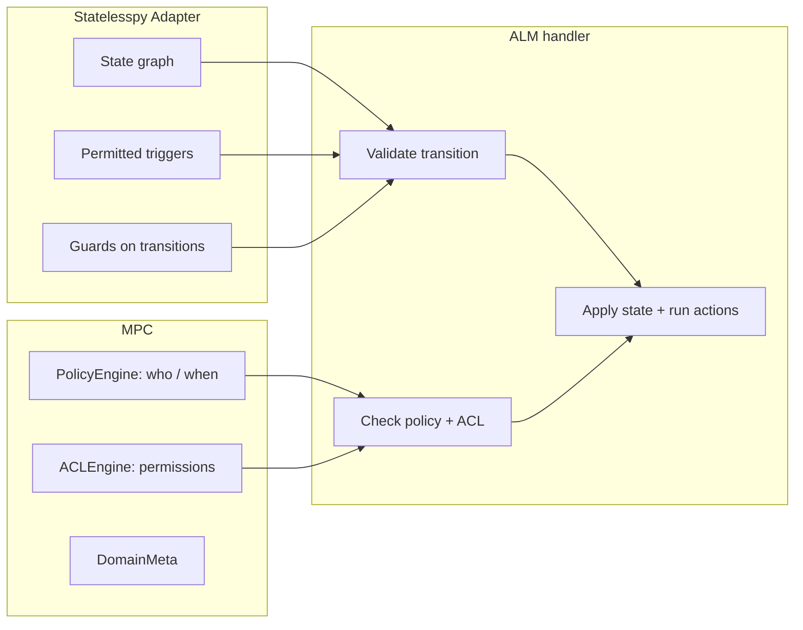

# Workflow Engine Boundary: Statelesspy vs MPC

This document describes the responsibility split between the **Statelesspy-based workflow adapter** and **MPC** (manifest-platform-core) in ALM artifact transitions. The adapter is the single source for the state graph; MPC handles policy and ACL only.

---

## 1. Responsibility Diagram

---

## 2. Statelesspy Adapter (workflow_sm)

| Responsibility | Description |
|----------------|--------------|
| **State graph** | Which (from_state, to_state) pairs are valid. Data source: manifest Workflow def (states + transitions). |
| **Permitted triggers** | From a given current state, which triggers (target state ids) are allowed. |
| **Guards** | Transition guards from the manifest (e.g. `assignee_required`) are evaluated by `guard_evaluator` (whitelist-only; no eval). Used to filter permitted triggers and to block transition when guard fails. |
| **Transition actions** | Returns on_leave / on_enter action names from manifest for a given (from, to); no execution. |

**Location:** `alm.artifact.domain.workflow_sm`. Used by `transition_artifact` and `create_artifact` handlers; `mpc_resolver.get_transition_actions` delegates to the adapter.

---

## 3. MPC

| Responsibility | Description |
|----------------|--------------|
| **PolicyEngine** | Event-based policy: who may perform the transition, under what conditions (e.g. roles, state). Returns allow/deny and violation messages. |
| **ACLEngine** | Resource/action permissions (e.g. artifact update). |
| **DomainMeta** | Kind/type metadata from manifest. |
| **TransitionPolicy (manifest)** | e.g. "assignee required when entering state X"; checked via `check_transition_policies`. |

**Not in MPC for workflow:** The workflow *graph* and *permitted transitions* are no longer resolved by MPC's WorkflowEngine in the transition path. MPC is used only for policy and ACL after the adapter has validated the transition.

---

## 4. Handler Order (transition_artifact)

1. **Resolve target state:** If client sent `trigger`, resolve to `to_state` via `get_permitted_triggers` (same manifest).
2. **Validate transition (adapter):** `workflow_sm.is_valid_transition(manifest, type_id, from_state, to_state)` — is this (from, to) allowed by the workflow?
3. **Evaluate guard (adapter):** If the transition has a `guard` in the manifest, `guard_evaluator.evaluate_guard(guard, artifact.to_snapshot_dict())` must be true; otherwise ValidationError.
4. **Check policy (MPC):** `check_transition_policies` (manifest TransitionPolicy) and `evaluate_transition_policy` (PolicyEngine). Merge violations.
5. **Apply:** Update artifact state, run on_leave/on_enter actions (action names from adapter; execution in ALM).

This keeps "invalid transition" (graph) and "guard not satisfied" (adapter) separate from "policy/ACL denied" (MPC).

---

## 5. Observability

Transition metrikleri, log ve tracing: [TRANSITION_OBSERVABILITY.md](TRANSITION_OBSERVABILITY.md).

---

## 6. References

- [MPC_BOUNDARY.md](MPC_BOUNDARY.md) — MPC vs ALM boundary in general.
- [manifest-dsl.md](manifest-dsl.md) — Workflow DSL (states, transitions).
- Guard security: [GUARD_EVALUATOR_SECURITY.md](GUARD_EVALUATOR_SECURITY.md).
