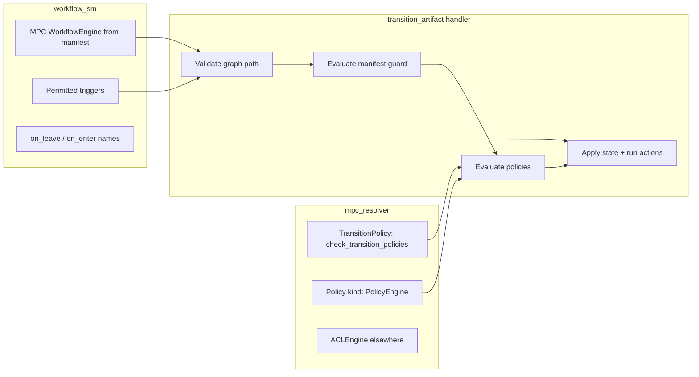

# Workflow Engine Boundary: workflow_sm and MPC

This document describes how **ALM** splits **workflow graph** concerns from **policy** concerns when moving an artifact between states.

---

## 1. Responsibility diagram

```mermaid
flowchart LR
  subgraph wf [workflow_sm]
    Graph[MPC WorkflowEngine from manifest]
    Triggers[Permitted triggers]
    Actions[on_leave / on_enter names]
  end
  subgraph pol [mpc_resolver]
    TP[TransitionPolicy: check_transition_policies]
    PE[Policy kind: PolicyEngine]
    ACL[ACLEngine elsewhere]
  end
  subgraph alm [transition_artifact handler]
    V[Validate graph path]
    G[Evaluate manifest guard]
    P[Evaluate policies]
    A[Apply state + run actions]
  end
  Graph --> V
  Triggers --> V
  V --> G
  G --> P
  TP --> P
  PE --> P
  P --> A
  Actions --> A
```

---

## 2. workflow_sm (`alm.artifact.domain.workflow_sm`)

| Responsibility | Description |
|----------------|-------------|
| **State graph** | Valid `(from_state, to_state)` pairs from the manifest `Workflow` def. |
| **Initial state** | First state for an artifact type. |
| **Permitted triggers** | From the current state, which trigger ids map to which target states. Manifest `trigger` is copied to MPC’s `on` when building the engine; UI label comes from `trigger_label` (or `label`) when present. If callers pass `entity_snapshot`, transitions whose `guard` fails `evaluate_guard` are omitted. |
| **Transition actions** | `on_leave` / `on_enter` action **names** for a transition (execution stays in ALM). |
| **Workflow def resolution** | Resolves `ArtifactType.workflow_id` → `Workflow` from `defs`. |

**Implementation:** When `mpc` is installed, this module constructs `mpc.features.workflow.WorkflowEngine` (`WorkflowEngine.from_fixture_input`). If `mpc` were absent, graph helpers would return empty / false; production images install `mpc` from `manifest-platform-core-suite`.

**Guards on transitions:** Manifest `guard` on the `(from_state, to_state)` edge is read via `get_transition_guard`, then evaluated with `guard_evaluator.evaluate_guard` and the artifact snapshot in `transition_artifact` **after** graph validation and **before** policy evaluation. Fail-closed for unknown guard types.

`mpc_resolver.get_transition_actions` delegates here so callers have one import surface for manifest-derived workflow data.

---

## 2.1 TransitionPolicy vs transition `guard`

| | **Transition `guard` (workflow edge)** | **`TransitionPolicy` (manifest def kind)** |
|--|----------------------------------------|--------------------------------------------|
| **Where** | `Workflow.transitions[]` entry: `guard` | Top-level `defs` item `kind: TransitionPolicy` |
| **Evaluated by** | `guard_evaluator.evaluate_guard` (whitelist) | `mpc_resolver.check_transition_policies` (event + AST) |
| **Typical use** | Per-edge precondition on the graph (e.g. assignee before leaving `new`) | Rules keyed by target state / event (e.g. require assignee when entering `active`) |
| **Failure** | `GuardDeniedError` | `PolicyDeniedError` (after guard passes) |

Avoid duplicating the same rule in both places; pick one style per concern so messages and metrics stay clear.

---

## 3. mpc_resolver — policy and AST

| Responsibility | Description |
|----------------|-------------|
| **AST** | `get_manifest_ast` / `normalize` (cached) or minimal fallback AST without `mpc`. |
| **TransitionPolicy** | `check_transition_policies(ast, event)` — e.g. `when.state` + `require: assignee`. Runs even when `PolicyEngine` is unavailable (fallback AST). |
| **Policy (kind)** | `evaluate_transition_policy` calls `PolicyEngine.evaluate` for defs with `kind == "Policy"`. |
| **Event shape** | `build_artifact_transition_policy_event(...)` builds the transition event used by both checks. |
| **ACL / redaction** | `acl_check`, `redact_data` for other endpoints. |

**Not here:** Workflow graph validation — that is `workflow_sm` before policy evaluation in the handler.

---

## 4. Handler order (`transition_artifact`)

1. **Resolve target state** from `trigger` or `new_state` (`get_permitted_triggers` when using triggers).
2. **Validate transition (graph):** `workflow_sm.is_valid_transition(...)`.
3. **Evaluate guard:** `get_transition_guard` + `evaluate_guard(guard, snapshot)`. On failure → `GuardDeniedError` (`/errors/guard-denied`, metrik `guard_denied`).
4. **Policies:** Build event with `build_artifact_transition_policy_event`, then `evaluate_transition_policy(ast, event, actor_roles)` (`check_transition_policies` then `PolicyEngine`). On deny → `PolicyDeniedError`.
5. **Reason / resolution** validation against manifest options.
6. **Apply:** `get_transition_actions`, `run_actions`, persist new state, `run_actions` for on_enter.

Invalid graph transitions, failed guards, and policy denials remain separate error types.

---

## 5. Observability

[TRANSITION_OBSERVABILITY.md](TRANSITION_OBSERVABILITY.md).

---

## 6. References

- [MPC_BOUNDARY.md](MPC_BOUNDARY.md)
- [manifest-dsl.md](manifest-dsl.md)
- [GUARD_EVALUATOR_SECURITY.md](GUARD_EVALUATOR_SECURITY.md)
