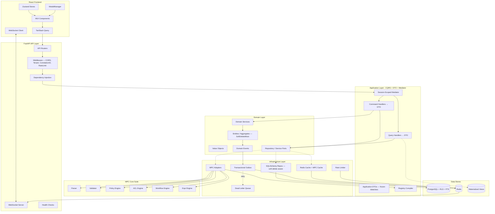

# ALM Manifest App - Mimari Tasarim ve Uygulama Plani

↑ [Tüm dokümanlar](README.md)

## İçindekiler

| # | Bölüm |
|---|--------|
| 1 | [Mevcut MPC Kütüphanesi Özeti](#1-mevcut-mpc-kutuphanesi-ozeti) |
| 2 | [Teknoloji Yığını (Tech Stack)](#2-teknoloji-yigini-tech-stack) |
| 3 | [Mimari Yapı (Architecture)](#3-mimari-yapi-architecture) |
| 4 | [Soft Delete Stratejisi](#4-soft-delete-stratejisi) |
| 5 | [Event-Driven Architecture](#5-event-driven-architecture) |
| 6 | [API Tasarım Standartları](#6-api-tasarim-standartlari) |
| 7 | [Güvenlik (Security)](#7-guvenlik-security) |
| 8 | [Observability Stack](#8-observability-stack) |
| 9 | [Data Stratejisi](#9-data-stratejisi) |
| 10 | [MPC Entegrasyonu - ALM DomainMeta](#10-mpc-entegrasyonu---alm-domainmeta) |
| 11 | [Veri Akışı Diyagramı](#11-veri-akisi-diyagrami) |
| 12 | [Aşama Planı (Phases)](#12-asama-plani-phases) |

---

## 1. Mevcut MPC Kutuphanesi Ozeti

`manifest-platform-core-suite` (MPC) zaten su yeteneklere sahip:

- **Manifest DSL/YAML/JSON** parser (Lark LALR)
- **DomainMeta** ile metadata-driven kind/type/function tanimlari
- **Policy, ACL, Workflow, Expression** engine'leri
- **Port/Adapter** pattern (GuardPort, AuthPort, SigningPort, VerificationPort)
- **Governance**: Bundle, signing, activation, quota enforcement
- **Conformance** test altyapisi

ALM uygulamasi MPC'nin bir **"consuming application"**'i olacak: `DomainMeta` tanimlayacak, Port'lari implemente edecek, engine sonuclarini (Decision/Intent) yorumlayacak.

---

## 2. Teknoloji Yigini (Tech Stack)

### Backend


| Katman        | Teknoloji                              | Neden                                                    |
| ------------- | -------------------------------------- | -------------------------------------------------------- |
| Framework     | **FastAPI 0.115+**                     | Async, OpenAPI, dependency injection                     |
| ORM           | **SQLAlchemy 2.0** (async)             | mapped_column, relationship, async session               |
| Validation    | **Pydantic v2**                        | Settings, request/response models                        |
| DB            | **PostgreSQL 16**                      | RLS (Row-Level Security) ile multi-tenancy               |
| Migration     | **Alembic**                            | Schema versioning                                        |
| Cache         | **Redis 7**                            | Session, cache, pub/sub, rate limiting                   |
| Task Queue    | **Taskiq + Redis**                     | Async background jobs (Celery alternatifi, async-native) |
| Auth          | **python-jose + passlib**              | JWT signing, password hashing                            |
| Logging       | **structlog**                          | Structured JSON logging + correlation ID                 |
| Tracing       | **opentelemetry**                      | Distributed tracing, trace_id propagation                |
| Metrics       | **prometheus-client**                  | Request latency, error rate, tenant-bazli usage          |
| Search        | **PostgreSQL FTS (tsvector)**          | Full-text search (Phase 1), Meilisearch (opsiyonel)      |
| Real-time     | **WebSocket (FastAPI) + Redis PubSub** | Live state updates, presence awareness                   |
| Error Format  | **Problem Details (RFC 9457)**         | Standart hata response formati                           |
| Rate Limiting | **redis + sliding window**             | Tenant-bazli rate limiting, burst/sustained ayrimi       |
| Security Scan | **Trivy + Dependabot**                 | Container + dependency vulnerability scanning            |
| Load Testing  | **k6 / Locust**                        | Performance baseline, SLO validation                     |
| Testing       | **pytest + httpx + factory-boy**       | Async test client, fixture factories                     |
| Contract Test | **Schemathesis**                       | OpenAPI contract/fuzz testing                            |
| Linting       | **ruff + mypy**                        | Fast linting + strict typing                             |


### Frontend


| Katman        | Teknoloji                               | Neden                                      |
| ------------- | --------------------------------------- | ------------------------------------------ |
| Build         | **Vite 6**                              | HMR, fast builds, bundle size analysis     |
| Framework     | **React 19 + TypeScript 5.7**           | Type safety                                |
| State         | **Zustand**                             | Lightweight, selector-based                |
| Server State  | **TanStack Query v5**                   | Cache, invalidation, optimistic updates    |
| UI            | **MUI v6**                              | Theming, DataGrid, TreeView                |
| Routing       | **React Router v7**                     | Nested layouts, loaders, lazy routes       |
| Forms         | **React Hook Form + Zod**               | Performant forms, schema validation        |
| Modal         | **Custom ModalManager** (Zustand-based) | Centralized, stack-based modal yonetimi    |
| Code Editor   | **Monaco Editor** (dynamic import)      | Manifest DSL editing, lazy loaded          |
| Real-time     | **native WebSocket + Zustand**          | Live updates, presence awareness           |
| Accessibility | **axe-core + eslint-plugin-jsx-a11y**   | WCAG 2.1 AA uyumluluk, keyboard navigation |
| Testing       | **Vitest + Testing Library + axe**      | Unit + component + a11y tests              |


### Ek Oneriler

- **Docker Compose** (dev ortam), **Dockerfile** (multi-stage)
- **Nginx** (frontend serving + reverse proxy)
- **Pre-commit** hooks (ruff, mypy, eslint, prettier)
- **GitHub Actions** CI/CD pipeline
- **Bundle size budget** (Vite plugin) — PR'da otomatik kontrol
- **Lighthouse CI** — performans ve a11y regression tespiti

---

## 3. Mimari Yapi (Architecture)

### 3.1 Backend - Clean Architecture + DDD + Hexagonal

```
backend/
├── src/alm/
│   ├── main.py                        # FastAPI app factory
│   ├── config/
│   │   ├── settings.py                # Pydantic BaseSettings (.env)
│   │   ├── dependencies.py            # FastAPI DI providers (get_db, get_mediator)
│   │   └── handler_registry.py        # Command/Query handler factory registration (startup)
│   │
│   ├── shared/                        # ── Shared Kernel ──
│   │   ├── domain/
│   │   │   ├── entity.py              # BaseEntity(id, created_at, created_by, updated_at, updated_by, deleted_at, deleted_by, to_snapshot_dict)
│   │   │   ├── aggregate.py           # AggregateRoot + domain events
│   │   │   ├── value_objects.py       # TenantId, UserId, Email, Slug
│   │   │   ├── repository.py          # Repository[T] port (ABC) — soft-delete aware
│   │   │   ├── unit_of_work.py        # UnitOfWork port (ABC)
│   │   │   ├── events.py              # DomainEvent base, EventBus port
│   │   │   └── exceptions.py          # DomainException hierarchy → Problem Details mapping
│   │   ├── application/
│   │   │   ├── command.py             # Command, CommandHandler ABCs
│   │   │   ├── query.py               # Query, QueryHandler ABCs
│   │   │   └── mediator.py            # Session-scoped Mediator (CQRS dispatch + auto-commit)
│   │   └── infrastructure/
│   │       ├── db/
│   │       │   ├── session.py         # async_session_factory, get_db
│   │       │   ├── base_model.py      # SQLAlchemy DeclarativeBase + SoftDeleteMixin + AuditMixin
│   │       │   ├── soft_delete.py     # SoftDeleteMixin(deleted_at) + query filter override
│   │       │   ├── tenant_context.py  # set_tenant_id() → RLS variable (after_begin hook)
│   │       │   └── read_models.py     # Denormalize read projections (materialized views)
│   │       ├── outbox/
│   │       │   ├── models.py          # OutboxMessage table (id, event_type, payload, created_at, published_at)
│   │       │   ├── publisher.py       # Outbox polling worker — Taskiq job
│   │       │   └── dead_letter.py     # Failed event retry + DLQ management
│   │       ├── cache.py               # Redis adapter
│   │       ├── event_bus.py           # Redis pub/sub event bus adapter
│   │       ├── rate_limiter.py        # Tenant-bazli sliding window rate limiter (Redis)
│   │       ├── websocket.py           # WebSocket manager + Redis PubSub bridge
│   │       ├── health.py              # /health/live + /health/ready endpoints
│   │       ├── correlation.py         # CorrelationID middleware (structlog + OpenTelemetry)
│   │       ├── error_handler.py       # Problem Details RFC 9457 exception handler
│   │       └── security/
│   │           ├── jwt.py             # JWT encode/decode, refresh
│   │           ├── password.py        # bcrypt hashing
│   │           ├── rbac.py            # MPC ACLEngine adapter
│   │           ├── csrf.py            # CSRF protection (SPA double-submit cookie)
│   │           └── sanitizer.py       # Input sanitization (XSS koruması, DSL content)
│   │   ├── audit/                     # ── JaVers-Inspired Audit/Snapshot System ──
│   │   │   ├── core.py               # ChangeType, GlobalId, PropertyChange, DiffEngine, AuditCommit, AuditSnapshot
│   │   │   ├── ports.py              # AuditStore, AuditReader ABCs
│   │   │   ├── interceptor.py        # buffer_audit(), AuditInterceptor (session-scoped)
│   │   │   ├── models.py             # audit_commits, audit_snapshots (PostgreSQL JSONB + ARRAY)
│   │   │   ├── repository.py         # SqlAlchemyAuditStore, SqlAlchemyAuditReader
│   │   │   ├── dtos.py               # SnapshotDTO, ChangeDTO, EntityHistoryDTO
│   │   │   ├── queries.py            # GetEntityHistory query handler
│   │   │   └── api/
│   │   │       ├── router.py         # GET /audit/{type}/{id}/history, .../snapshots/{version}
│   │   │       └── schemas.py        # Pydantic response schemas
│   │
│   ├── auth/                          # ── Auth Bounded Context ──
│   │   ├── domain/
│   │   │   ├── entities.py            # User, RefreshToken (soft-delete)
│   │   │   ├── value_objects.py       # HashedPassword, TokenPair
│   │   │   ├── events.py             # UserRegistered, UserLoggedIn, PasswordChanged
│   │   │   └── ports.py              # UserRepository, RefreshTokenRepository (ABC)
│   │   ├── application/
│   │   │   ├── dtos.py               # TokenPairDTO, LoginResultDTO, CurrentUserDTO
│   │   │   ├── commands/              # RegisterUser, Login, RefreshToken, SwitchTenant, ChangePassword
│   │   │   └── queries/              # GetCurrentUser
│   │   ├── infrastructure/
│   │   │   ├── models.py             # SQLAlchemy models (NO RLS — global tables)
│   │   │   └── repositories.py       # SQLAlchemy repository impls
│   │   └── api/
│   │       ├── router.py             # /api/v1/auth/* (Mediator dispatch)
│   │       └── schemas.py            # Pydantic request/response
│   │
│   ├── tenant/                        # ── Tenant Bounded Context ──
│   │   ├── domain/
│   │   │   ├── entities.py            # Tenant, TenantMembership, Role, Privilege, Invitation
│   │   │   ├── value_objects.py       # TenantTier, InviteToken, PrivilegeCode, RoleSlug
│   │   │   ├── events.py             # TenantCreated, MemberInvited, RoleAssigned, ...
│   │   │   ├── services.py           # TenantOnboardingSaga, PermissionResolver
│   │   │   └── ports.py              # TenantRepo, MembershipRepo, RoleRepo, PrivilegeRepo, InvitationRepo
│   │   ├── application/
│   │   │   ├── dtos.py               # TenantDTO, RoleDetailDTO, MemberDTO, PrivilegeDTO, ...
│   │   │   ├── commands/              # CreateTenant, InviteMember, CreateRole, AssignRoles, ...
│   │   │   └── queries/              # ListMyTenants, ListMembers, ListRoles, GetRole, ListPrivileges
│   │   ├── infrastructure/
│   │   │   ├── models.py             # SQLAlchemy: Tenant, Membership, Role, Privilege, ... (NO RLS)
│   │   │   └── repositories.py       # SQLAlchemy repository impls
│   │   └── api/
│   │       ├── router.py             # /api/v1/tenants/* (Mediator dispatch)
│   │       └── schemas.py            # Pydantic request/response
│   │
│   ├── manifest/                      # ── Manifest Bounded Context (MPC Hub) ──
│   │   ├── domain/
│   │   │   ├── entities.py            # ManifestDocument, ManifestVersion (soft-delete)
│   │   │   ├── value_objects.py       # ManifestContent, ArtifactHash
│   │   │   ├── ports.py              # ManifestRepository, StoragePort, MPCCachePort
│   │   │   └── services.py           # ManifestDomainService (parse→validate→compile)
│   │   ├── application/
│   │   │   ├── commands/              # CreateManifest, UpdateManifest, ActivateManifest
│   │   │   └── queries/              # GetManifest, ListManifests, PreviewParse
│   │   ├── infrastructure/
│   │   │   ├── models.py             # SQLAlchemy: manifest_documents, manifest_versions
│   │   │   ├── repositories.py
│   │   │   ├── mpc_adapter.py        # MPC engine wrappers (GuardPort, AuthPort impls)
│   │   │   └── mpc_cache.py          # MPC parse/compile result cache (Redis, per ManifestVersion)
│   │   └── api/
│   │       ├── router.py             # /api/v1/manifests/*
│   │       └── schemas.py
│   │
│   ├── project/                       # ── Project BC ──
│   │   ├── domain/                    # Project, ProjectMember, ProjectSettings (soft-delete)
│   │   ├── application/
│   │   ├── infrastructure/
│   │   └── api/                       # /api/v1/projects/*
│   │
│   ├── artifact/                      # ── Artifact BC (Requirement, Defect, Epic) ──
│   │   ├── domain/
│   │   │   ├── entities.py            # Artifact (polymorphic, soft-delete), Comment, Attachment
│   │   │   ├── value_objects.py       # ArtifactType, Priority, Severity
│   │   │   └── ports.py
│   │   ├── application/
│   │   │   ├── commands/              # CreateArtifact, TransitionState, AddComment, SoftDeleteArtifact
│   │   │   └── queries/              # ListArtifacts, GetArtifact, SearchArtifacts
│   │   ├── infrastructure/
│   │   │   ├── models.py             # SQLAlchemy models + tsvector index (full-text search)
│   │   │   ├── repositories.py
│   │   │   └── read_models.py        # Artifact read projections (denormalized, dashboard-ready)
│   │   └── api/                       # /api/v1/artifacts/*
│   │
│   ├── task/                          # ── Task BC (separate aggregate) ──
│   │   ├── domain/
│   │   │   ├── entities.py            # Task (own aggregate root, soft-delete), TaskLink
│   │   │   ├── value_objects.py       # TaskStatus, EstimatedEffort
│   │   │   └── ports.py
│   │   ├── application/
│   │   │   ├── commands/              # CreateTask, CompleteTask, LinkToArtifact, AssignTask
│   │   │   └── queries/              # ListTasks, GetTask, GetTasksByArtifact
│   │   ├── infrastructure/
│   │   │   ├── models.py             # SQLAlchemy models + artifact_id FK
│   │   │   └── repositories.py
│   │   └── api/                       # /api/v1/tasks/*
│   │
│   ├── workflow/                      # ── Workflow Execution BC ──
│   │   ├── domain/
│   │   │   ├── entities.py            # WorkflowInstance, StateHistory
│   │   │   ├── ports.py              # MPC WorkflowEngine GuardPort/AuthPort impls
│   │   │   └── services.py           # WorkflowExecutionService
│   │   ├── application/
│   │   ├── infrastructure/
│   │   │   └── mpc_workflow_adapter.py  # GuardPort + AuthPort concrete impls
│   │   └── api/                       # /api/v1/workflows/*
│   │
│
├── tests/
│   ├── unit/                          # Domain + application layer tests
│   ├── integration/                   # Infrastructure + DB tests
│   ├── e2e/                           # Full API tests
│   ├── security/                      # RLS isolation tests, CSRF, XSS, injection
│   ├── performance/                   # k6/Locust scripts, baseline definitions
│   ├── factories/                     # factory-boy factories
│   └── conftest.py                    # Fixtures, test DB, test tenant
│
├── migrations/                        # Alembic
│   ├── env.py
│   └── versions/
│
├── alm_meta/                          # ALM DomainMeta definitions (YAML/JSON)
│   ├── domain_meta.yaml               # KindDefs: Requirement, Defect, Task, Epic, Cycle...
│   ├── domain_meta_changelog.yaml     # DomainMeta versiyon gecmisi
│   ├── presets/
│   ├── seed/                          # Tenant onboarding seed data
│   │   ├── default_workflow.yaml
│   │   ├── default_policies.yaml
│   │   ├── default_roles.yaml         # System roles (N:N privilege mapping)
│   │   └── default_privileges.yaml    # Application-wide privilege definitions
│   └── manifests/                     # Seed manifest files
│
├── pyproject.toml
├── Dockerfile
└── docker-compose.yml
```

### 3.2 CQRS + DTO + Mediator Pattern

Tum BC'ler icin zorunlu mimari pattern. Handler, router ve application layer kodlarinda uyulmasi gereken kurallar:

#### Katman Akisi

```
Router (API) ─Depends(get_mediator)─→ Mediator
                                        │
                          ┌─── .send(command) ──→ CommandHandler → DTO (auto-commit)
                          └─── .query(query)  ──→ QueryHandler  → DTO (no commit)
                                        │
                                  Router ←── DTO
                                        │
                                  Pydantic Schema → JSON Response
```

- **Router** ASLA dogrudan handler veya repository olusturmaz
- **Router** ASLA domain entity dondürmez veya entity property'lerine erismez
- **Handler** ASLA Pydantic schema kullanmaz (application layer framework-agnostic)

#### Application-Level DTO

Her handler'in donus tipi `frozen dataclass` DTO olmalidir. DTO'lar her BC'nin `application/dtos.py` dosyasinda tanimlanir:

```python
# {bc}/application/dtos.py
@dataclass(frozen=True)
class RoleDetailDTO:
    id: uuid.UUID
    name: str
    slug: str
    description: str
    is_system: bool
    hierarchy_level: int
    privileges: list[PrivilegeDTO] = field(default_factory=list)
```

**Yasaklar:**
- `dict[str, Any]` donus tipi kullanilmaz
- Domain entity (Role, User, Tenant) dogrudan dondurulemez

#### Session-Scoped Mediator

`Mediator` her request icin `get_mediator()` dependency ile olusturulur. Bir `AsyncSession` alir ve handler factory'leri uzerinden handler'i lazily create eder:

```python
# config/dependencies.py
async def get_mediator() -> AsyncGenerator[Mediator, None]:
    async with async_session_factory() as session:
        yield Mediator(session)
```

- `mediator.send(command)` — write islemleri, otomatik `session.commit()`
- `mediator.query(query)` — read islemleri, commit yok

#### Handler Registry

Tum handler factory'leri `config/handler_registry.py`'de merkezi olarak kayitlidir. Uygulama baslatilirken (`lifespan`) `register_all_handlers()` cagirilir:

```python
register_command_handler(CreateRole, lambda s: CreateRoleHandler(
    role_repo=SqlAlchemyRoleRepository(s),
    privilege_repo=SqlAlchemyPrivilegeRepository(s),
))
```

Handler constructor'ina SADECE repository port'lari (ABC) gecirilir — concrete implementation registry'de resolve edilir.

#### Yeni Command/Query Ekleme Checklist

1. `{bc}/application/commands/` veya `queries/` altinda `@dataclass(frozen=True)` command/query + handler
2. `{bc}/application/dtos.py`'ye donus DTO'su ekle (yoksa)
3. Handler donus tipi: `CommandHandler[MyDTO]` / `QueryHandler[MyDTO]`
4. `config/handler_registry.py`'ye factory kaydet
5. `{bc}/api/schemas.py`'ye Pydantic response schema ekle (yoksa)
6. Router endpoint'inde `mediator.send/query` kullan, DTO→schema mapping yap

### 3.3 JaVers-Inspired Audit System (Object Change Tracking)

Her entity degisikligi (create/update/delete) otomatik olarak izlenir. JaVers'in Python implementasyonu.

#### Temel Kavramlar

| Kavram | Aciklama |
|--------|----------|
| `AuditCommit` | Bir islem grubundaki tum snapshot'lari gruplar (author, tenant, timestamp) |
| `AuditSnapshot` | Bir entity'nin belirli andaki tam serializasyonu (JSONB state, version) |
| `GlobalId` | Entity tipi + UUID: `"Role/550e8400-..."` |
| `ChangeType` | `INITIAL` (ilk kayit), `UPDATE`, `DELETE` (soft-delete) |
| `DiffEngine` | Iki snapshot arasi property-level fark hesaplama |
| `PropertyChange` | Tek bir field degisikligi: `(property_name, left, right)` |

#### Veri Akisi

```
Repository.add(entity)
  ├─ session.flush()
  ├─ buffer_events(session, entity.collect_events())    ← domain events
  └─ buffer_audit(session, "Role", id, state, INITIAL)  ← audit snapshot
          │
Mediator.send(command)
  ├─ handler.handle(command)
  ├─ _process_audit()  ←── AuditInterceptor:
  │     ├─ prev_snapshot = SELECT ... ORDER BY version DESC
  │     ├─ changed_props = DiffEngine.changed_property_names(prev, current)
  │     ├─ INSERT audit_commits (author_id, tenant_id, committed_at)
  │     └─ INSERT audit_snapshots (global_id, state, changed_properties, version)
  ├─ session.commit()  ←── tumu TEK transaction
  └─ _dispatch_collected_events()
```

#### BaseEntity Audit Field'lari

```python
class BaseEntity:
    id: uuid.UUID
    created_at: datetime
    created_by: uuid.UUID | None    # ← kim olusturdu
    updated_at: datetime
    updated_by: uuid.UUID | None    # ← kim guncelledi
    deleted_at: datetime | None
    deleted_by: uuid.UUID | None

    def to_snapshot_dict(self) -> dict:  # ← audit icin otomatik serialize
```

#### DB Semasi

```sql
-- audit_commits: islem grubu
CREATE TABLE audit_commits (
    id UUID PRIMARY KEY,
    author_id UUID,          -- JWT'den otomatik (session.info["_actor_id"])
    tenant_id UUID,
    committed_at TIMESTAMPTZ NOT NULL DEFAULT NOW(),
    properties JSONB DEFAULT '{}'
);

-- audit_snapshots: entity state at a point in time
CREATE TABLE audit_snapshots (
    id UUID PRIMARY KEY,
    commit_id UUID REFERENCES audit_commits(id),
    global_id VARCHAR(500),  -- "Role/uuid"
    entity_type VARCHAR(128),
    entity_id UUID,
    change_type VARCHAR(16), -- INITIAL, UPDATE, DELETE
    state JSONB,             -- tam entity state
    changed_properties TEXT[],
    version INT DEFAULT 1
);
-- Composite index: (entity_type, entity_id, version) for fast history
```

#### API Endpoint'leri

| Method | Path | Aciklama |
|--------|------|----------|
| `GET` | `/api/v1/audit/{entity_type}/{entity_id}/history` | Paginated history + diff |
| `GET` | `/api/v1/audit/{entity_type}/{entity_id}/snapshots/{version}` | Specific version snapshot |

#### Yeni Entity Icin Audit Ekleme Checklist

1. Entity `BaseEntity` veya `AggregateRoot` extend etsin
2. Repository `add()` / `update()` / `soft_delete()` sonrasi `buffer_audit()` cagir
3. `_to_entity()` metodunda `created_by` ve `updated_by` field'larini map et
4. Audit otomatik olarak Mediator tarafindan commit oncesi islenir (ek kod gerekmez)

### 3.4 Multi-Tenancy Stratejisi (PostgreSQL RLS)

```sql
-- Her tablo tenant_id iceriyor
ALTER TABLE artifacts ENABLE ROW LEVEL SECURITY;
CREATE POLICY tenant_isolation ON artifacts
  USING (tenant_id = current_setting('app.current_tenant_id')::uuid);

-- Soft-delete RLS ile birlesik: sadece silinmemis kayitlar gozukur
CREATE POLICY active_records ON artifacts
  USING (deleted_at IS NULL);
```

FastAPI middleware her request'te JWT'den `tenant_id` cikarip `SET LOCAL app.current_tenant_id = '...'` calistiriyor. Boylece ORM seviyesinde tenant filtresi gerekmiyor — DB kendisi izole ediyor.

#### Connection Pooling + RLS Guvenlik

`SET LOCAL` sadece transaction icinde gecerli. SQLAlchemy async session'da `after_begin` event hook'u kullanilarak her transaction basinda tenant_id set edilir — bu sayede connection pool'dan alinan baglantilarda onceki tenant'in verisine erisim riski ortadan kalkar:

```python
@event.listens_for(async_session_factory.sync_session_class, "after_begin")
def set_tenant_on_begin(session, transaction, connection):
    tenant_id = get_current_tenant_id()  # contextvar'dan
    connection.execute(text(f"SET LOCAL app.current_tenant_id = '{tenant_id}'"))
```

#### Tenant Onboarding Saga

Yeni tenant olusturuldiginda `TenantOnboardingSaga` calisir:

1. Tenant kaydini olustur
2. Varsayilan rolleri yukle (`default_roles.yaml`)
3. Varsayilan workflow'lari yukle (`default_workflow.yaml`)
4. Varsayilan policy'leri yukle (`default_policies.yaml`)
5. Admin kullaniciyi ata
6. Onboarding tamamlandi event'i yayinla

Herhangi bir adim basarisiz olursa tum saga rollback yapilir (compensation events).

#### RLS Izolasyon Test Stratejisi

CI pipeline'da her run'da calisacak test suite:

- **Cross-tenant leak test**: Tenant A'nin session'i ile Tenant B'nin verisine erisim denemesi → 0 row donmeli
- **Superuser bypass test**: RLS policy'sinin superuser'da bypasslanmadigini dogrula (app user'i `NOSUPERUSER`)
- **Deleted record invisibility**: Soft-delete edilmis kayitlarin RLS policy ile filtrelendigini dogrula
- **Connection pool reuse test**: Farkli tenant'lar icin art arda gelen request'lerde veri sizintisi olmadigini dogrula

### 3.5 Frontend - Feature-Sliced Architecture

```
frontend/
├── src/
│   ├── app/
│   │   ├── App.tsx                    # Root component
│   │   ├── router.tsx                 # React Router config (lazy routes)
│   │   ├── providers.tsx              # QueryClient, Theme, ModalProvider, WebSocketProvider
│   │   └── theme.ts                   # MUI theme customization (a11y contrast ratios)
│   │
│   ├── shared/
│   │   ├── api/
│   │   │   ├── client.ts             # Axios/fetch instance + interceptors + retry (exp. backoff)
│   │   │   ├── types.ts              # Shared API types + ProblemDetail error type
│   │   │   └── websocket.ts          # WebSocket client + auto-reconnect + Zustand bridge
│   │   ├── components/
│   │   │   ├── Layout/               # AppBar, Sidebar, Breadcrumbs
│   │   │   ├── DataTable/            # MUI DataGrid wrapper + soft-delete filter toggle
│   │   │   ├── FormBuilder/          # Metadata-driven dynamic form renderer
│   │   │   ├── ModalManager/         # Zustand-based modal stack manager
│   │   │   ├── ErrorBoundary/        # Granular error boundary with retry
│   │   │   ├── OfflineBanner/        # Network status indicator
│   │   │   └── SkipToContent/        # a11y: skip navigation link
│   │   ├── hooks/
│   │   │   ├── useAuth.ts
│   │   │   ├── useTenant.ts
│   │   │   ├── usePermissions.ts     # MPC ACL result checker
│   │   │   ├── useWebSocket.ts       # Real-time event subscription hook
│   │   │   ├── usePresence.ts        # Who is viewing this entity?
│   │   │   └── useNetworkStatus.ts   # Online/offline detection
│   │   └── stores/
│   │       ├── authStore.ts          # JWT tokens, user
│   │       ├── tenantStore.ts        # Active tenant
│   │       ├── modalStore.ts         # Modal stack state
│   │       ├── wsStore.ts            # WebSocket connection state + message buffer
│   │       └── notificationStore.ts  # Toast/notification queue
│   │
│   ├── features/
│   │   ├── auth/
│   │   │   ├── pages/               # Login, Register (lazy loaded)
│   │   │   ├── components/
│   │   │   └── api/                  # Auth API hooks (TanStack Query)
│   │   ├── dashboard/
│   │   │   ├── pages/               # Dashboard (lazy loaded, read-model backed)
│   │   │   └── components/          # KPI cards, charts, activity feed
│   │   ├── projects/
│   │   ├── artifacts/
│   │   │   ├── pages/               # ArtifactList, ArtifactDetail (lazy loaded)
│   │   │   ├── components/          # ArtifactForm, StateTransitionButton, PresenceAvatars, LinkedTasks
│   │   │   └── api/                 # Optimistic update + conflict resolution hooks
│   │   ├── tasks/
│   │   │   ├── pages/               # TaskBoard (kanban), TaskDetail (lazy loaded)
│   │   │   ├── components/          # TaskForm, TaskCard, QuickAddTask
│   │   │   └── api/
│   │   ├── manifests/
│   │   │   ├── pages/               # ManifestEditor (Monaco — dynamic import), ManifestList
│   │   │   ├── components/          # DSLEditor, ManifestPreview, DiffViewer
│   │   │   └── api/
│   │   ├── workflows/
│   │   │   ├── pages/               # WorkflowDesigner, WorkflowInstances (lazy loaded)
│   │   │   └── components/          # StateGraph (visual FSM), real-time transition feed
│   │   └── settings/
│   │       ├── pages/               # TenantSettings, UserManagement
│   │       └── components/
│   │
│   └── main.tsx
│
├── package.json
├── vite.config.ts                     # Bundle analyzer + size limit plugin
├── tsconfig.json
├── lighthouserc.json                  # Lighthouse CI config (perf + a11y thresholds)
└── Dockerfile
```

#### Code Splitting Stratejisi

- **Route-based splitting**: Tum feature page'leri `React.lazy()` + `Suspense` ile lazy loaded
- **Heavy dependency isolation**: Monaco Editor, chart kutuphaneleri `dynamic import()` ile yuklenecek
- **Bundle size budget**: Vite `rollup-plugin-visualizer` + CI'da max bundle size check
- **Prefetch**: Kullanicinin muhtemelen gidecegi route'lar icin `<link rel="prefetch">`

#### Optimistic Updates + Conflict Resolution

```typescript
// TanStack Query mutation with optimistic update + server reconciliation
useMutation({
  mutationFn: updateArtifact,
  onMutate: async (newData) => {
    await queryClient.cancelQueries({ queryKey: ['artifacts', id] });
    const previous = queryClient.getQueryData(['artifacts', id]);
    queryClient.setQueryData(['artifacts', id], newData);
    return { previous };
  },
  onError: (err, newData, context) => {
    // Rollback on failure
    queryClient.setQueryData(['artifacts', id], context.previous);
    if (err.status === 409) {
      // Conflict: server'daki guncel veriyi goster, kullaniciya sec
      showConflictResolutionModal(context.previous, err.serverData);
    }
  },
  onSettled: () => queryClient.invalidateQueries({ queryKey: ['artifacts', id] }),
});
```

#### Accessibility (a11y) Hedefleri

- **WCAG 2.1 AA** uyumluluk (MUI bunu buyuk olcude destekler)
- **Keyboard navigation**: Tum interactive element'ler tab ile erisilebilir, DataGrid arrow key navigation
- **Focus management**: Modal acildiginda focus trap, kapatildiginda onceki element'e donus
- **Screen reader**: ARIA label'lar, live region'lar (state transition bildirimler)
- **Color contrast**: MUI theme'de minimum 4.5:1 ratio enforce
- **Test**: `axe-core` integration testlerde, `eslint-plugin-jsx-a11y` lint'te

### 3.6 ModalManager Tasarimi (Zustand)

```typescript
// modalStore.ts
interface ModalState {
  stack: Array<{
    id: string;
    component: ComponentType<any>;
    props: Record<string, any>;
    options: { size?: 'sm'|'md'|'lg'|'xl'; closable?: boolean };
  }>;
  open: (id, component, props?, options?) => void;
  close: (id?: string) => void;  // id yoksa en usttekini kapat
  closeAll: () => void;
  update: (id, props) => void;
}
```

Sayfa bazinda modal acma/kapatma Zustand store uzerinden, `ModalManager` component'i stack'teki tum modallari MUI Dialog ile renderliyor.

---

## 4. Soft Delete Stratejisi

Tum entity'ler (AuditEntry haric) **soft delete** kullanir. Hard delete sadece GDPR/veri silme talepleri icin admin-only islemdir.

### 4.1 BaseEntity Soft Delete

```python
class SoftDeleteMixin:
    deleted_at: Mapped[datetime | None] = mapped_column(
        DateTime(timezone=True), nullable=True, default=None, index=True
    )
    deleted_by: Mapped[uuid.UUID | None] = mapped_column(
        ForeignKey("users.id"), nullable=True, default=None
    )

    @property
    def is_deleted(self) -> bool:
        return self.deleted_at is not None

    def soft_delete(self, by: uuid.UUID) -> None:
        self.deleted_at = datetime.now(UTC)
        self.deleted_by = by
        self._register_event(EntitySoftDeleted(entity_id=self.id, deleted_by=by))

    def restore(self, by: uuid.UUID) -> None:
        self.deleted_at = None
        self.deleted_by = None
        self._register_event(EntityRestored(entity_id=self.id, restored_by=by))
```

### 4.2 Repository Soft Delete Destegi

```python
class SoftDeleteRepository(Repository[T], ABC):
    """Varsayilan olarak sadece aktif kayitlari dondurur."""

    async def find_by_id(self, id: UUID, include_deleted: bool = False) -> T | None: ...
    async def find_all(self, include_deleted: bool = False) -> list[T]: ...
    async def soft_delete(self, id: UUID, deleted_by: UUID) -> None: ...
    async def restore(self, id: UUID) -> None: ...
    async def hard_delete(self, id: UUID) -> None:
        """Sadece admin/GDPR islemleri icin. Audit log'a kaydedilir."""
        ...
```

### 4.3 SQLAlchemy Query Filter Override

```python
# Otomatik olarak deleted_at IS NULL filtresi uygular
# include_deleted=True ile bypass edilebilir (admin paneli, audit)
@compiles(Select)
def soft_delete_filter(select, compiler, **kw):
    # SoftDeleteMixin olan tablolara otomatik WHERE deleted_at IS NULL ekler
    ...
```

### 4.4 Cascade Soft Delete Kurallari

| Parent Entity      | Child Entity        | Cascade Davranisi                         |
| ------------------- | ------------------- | ----------------------------------------- |
| Project            | Artifact            | Project silinince Artifact'lar da silinir |
| Artifact           | Comment, Attachment | Artifact silinince child'lar da silinir   |
| Task               | (none — standalone) | Task'lar bagimsiz silinir, artifact link kopar |
| Tenant             | Tum tenant verileri | Tenant deaktive → tum veri soft-delete    |
| ManifestDocument   | ManifestVersion     | Document silinince version'lar da silinir |

### 4.5 UI Entegrasyonu

- DataTable'da "Silinmisleri goster" toggle (varsayilan: gizli)
- Silinen kayitlar soluk/strikethrough stilde gosterilir
- "Geri Al" (restore) aksiyonu silinen kayitlarda gorunur
- Hard delete sadece admin Settings sayfasindan eriselebilir

---

## 5. Event-Driven Architecture

### 5.1 Transactional Outbox Pattern

Domain event'ler dogrudan publish edilmez — once ayni transaction icinde `outbox_messages` tablosuna yazilir, ardindan ayri bir worker tarafindan publish edilir. Bu sayede event kaybi riski sifirlanir.

```
┌─────────────────────────────────────────────┐
│  Command Handler (Transaction)              │
│                                             │
│  1. Entity'yi guncelle                      │
│  2. Domain Event'i outbox_messages'a yaz    │
│  3. COMMIT (atomik)                         │
└──────────────────────┬──────────────────────┘
                       │
            ┌──────────▼──────────┐
            │  Outbox Publisher    │
            │  (Taskiq Worker)    │
            │                     │
            │  - Poll outbox      │
            │  - Publish to Redis │
            │  - Mark published   │
            └──────────┬──────────┘
                       │
         ┌─────────────▼─────────────┐
         │  Redis PubSub / EventBus  │
         │                           │
         │  → Event Handlers         │
         │  → WebSocket broadcast    │
         │  → Audit log writer       │
         └───────────────────────────┘
```

### 5.2 Outbox Message Tablosu

```python
class OutboxMessage(Base):
    __tablename__ = "outbox_messages"

    id: Mapped[UUID]
    event_type: Mapped[str]           # "artifact.state_transitioned"
    aggregate_type: Mapped[str]       # "Artifact"
    aggregate_id: Mapped[UUID]
    payload: Mapped[dict]             # JSON serialized event data
    tenant_id: Mapped[UUID]
    correlation_id: Mapped[str]       # Request correlation ID
    created_at: Mapped[datetime]
    published_at: Mapped[datetime | None]
    retry_count: Mapped[int] = 0
    error: Mapped[str | None]         # Son hata mesaji
```

### 5.3 Event Versioning

Event schema'lari zamanla degisir. Her event tipi `schema_version` tasir:

```python
class ArtifactCreated(DomainEvent):
    schema_version: int = 2
    artifact_id: UUID
    title: str
    artifact_type: str
    # v2'de eklendi:
    project_id: UUID | None = None
```

Eski versiyon event'ler icin **upcaster** chain'i kullanilir — v1 event'i v2'ye donusturulur.

### 5.4 Dead Letter Queue (DLQ)

- Basarisiz event'ler `retry_count` arttirilarak yeniden denenir (max 5, exponential backoff)
- 5 denemeden sonra `dead_letter_messages` tablosuna tasinir
- Admin panelinde DLQ goruntuleme ve manual retry imkani
- Alerting: DLQ'da N'den fazla mesaj birikirse bildirim

---

## 6. API Tasarim Standartlari

### 6.1 API Versioning

- **URL-based versioning**: `/api/v1/`, `/api/v2/` (primary)
- **Deprecation header**: `Deprecation: true`, `Sunset: 2026-12-01` header'lari
- Eski versiyon en az **6 ay** desteklenir (sunset policy)
- API changelog otomatik olusturulur (OpenAPI diff)

### 6.2 Error Response (Problem Details - RFC 9457)

Tum hata response'lari `application/problem+json` formatinda:

```json
{
  "type": "https://alm.example.com/errors/artifact-not-found",
  "title": "Artifact Not Found",
  "status": 404,
  "detail": "Artifact with id '550e8400-...' does not exist or has been deleted.",
  "instance": "/api/v1/artifacts/550e8400-...",
  "correlation_id": "req-abc123",
  "trace_id": "otel-trace-xyz"
}
```

Domain exception → HTTP status mapping:

| Domain Exception          | HTTP Status | Problem Type                  |
| ------------------------- | ----------- | ----------------------------- |
| `EntityNotFound`          | 404         | `/errors/entity-not-found`    |
| `ValidationError`         | 422         | `/errors/validation-error`    |
| `AccessDenied`            | 403         | `/errors/access-denied`       |
| `ConflictError`           | 409         | `/errors/conflict`            |
| `RateLimitExceeded`       | 429         | `/errors/rate-limit-exceeded` |
| `TenantQuotaExceeded`     | 429         | `/errors/quota-exceeded`      |
| `WorkflowTransitionError` | 422         | `/errors/invalid-transition`  |

### 6.3 Rate Limiting

Tenant-bazli sliding window rate limiter (Redis):

| Tier       | Requests/min | Burst | Aciklama              |
| ---------- | ------------ | ----- | --------------------- |
| Free       | 60           | 10    | Temel kullanim        |
| Pro        | 300          | 50    | Profesyonel takimlar  |
| Enterprise | 1000         | 200   | Buyuk organizasyonlar |

Response header'lari: `X-RateLimit-Limit`, `X-RateLimit-Remaining`, `X-RateLimit-Reset`

### 6.4 Correlation ID + Request Tracing

Her request'e `X-Correlation-ID` header'i atanir (yoksa UUID olusturulur). Bu ID:

- structlog'da her log satirina eklenir
- OpenTelemetry trace'e baglanir (`trace_id` ↔ `correlation_id`)
- Outbox event'lerine yazilir
- Hata response'larinda doner
- Frontend'den backend'e propagate edilir

---

## 7. Guvenlik (Security)

### 7.1 Input Sanitization

- Manifest DSL editor'den gelen icerik MPC parser'dan gecirilir (injection korumasi)
- Comment/description alanlari HTML sanitize edilir (bleach/nh3)
- SQL injection: SQLAlchemy parameterized queries (zaten varsayilan)

### 7.2 CSRF Protection

SPA icin **double-submit cookie** pattern:

1. Backend login'de `csrf_token` cookie set eder (`SameSite=Strict`, `HttpOnly=false`)
2. Frontend her mutation request'inde `X-CSRF-Token` header'ina cookie degerini koyar
3. Backend cookie ile header'i karsilastirir

### 7.3 Secret Management

| Ortam       | Yontem                                |
| ----------- | ------------------------------------- |
| Development | `.env` dosyasi (gitignore'da)         |
| Staging     | Docker secrets / HashiCorp Vault      |
| Production  | AWS Secrets Manager / Azure Key Vault |

### 7.4 Dependency Scanning

- **Trivy**: Docker image vulnerability scan (CI'da her build'de)
- **Dependabot / Renovate**: Otomatik dependency update PR'lari
- **pip-audit**: Python dependency CVE taramasi
- **npm audit**: Frontend dependency CVE taramasi

### 7.5 Security Test Plani

- CI'da otomatik: dependency scan, SAST (bandit/semgrep)
- Cycle/iteration bazinda: OWASP ZAP ile DAST
- Release oncesi: 3rd-party penetration test (Phase 12)

---

## 8. Observability Stack

### 8.1 Uc Sutun (Three Pillars)

```
┌─────────────┐    ┌──────────────┐    ┌─────────────┐
│   Logging    │    │   Tracing    │    │   Metrics   │
│  (structlog) │    │ (OpenTelemetry)│  │ (Prometheus) │
│              │    │              │    │              │
│  → Loki /    │    │  → Jaeger /  │    │  → Grafana   │
│    ELK       │    │    Tempo     │    │    dashboards│
└──────┬───────┘    └──────┬───────┘    └──────┬───────┘
       │                   │                   │
       └───────────────────┼───────────────────┘
                           │
                    correlation_id
                    (hepsini birbirine baglar)
```

### 8.2 Metrik Tanimlari

| Metrik                          | Tip       | Label'lar                    |
| ------------------------------- | --------- | ---------------------------- |
| `http_requests_total`           | Counter   | method, path, status, tenant |
| `http_request_duration_seconds` | Histogram | method, path, tenant         |
| `domain_events_published_total` | Counter   | event_type, tenant           |
| `outbox_pending_messages`       | Gauge     | tenant                       |
| `outbox_dlq_messages`           | Gauge     | tenant                       |
| `websocket_active_connections`  | Gauge     | tenant                       |
| `mpc_parse_duration_seconds`    | Histogram | manifest_kind                |
| `db_query_duration_seconds`     | Histogram | query_type                   |
| `rate_limit_exceeded_total`     | Counter   | tenant, tier                 |

### 8.3 Health Checks

```
GET /health/live    → { "status": "ok" }                    # Kubernetes liveness
GET /health/ready   → { "status": "ok", "db": "ok",        # Kubernetes readiness
                        "redis": "ok", "outbox_lag": "2s" }
```

### 8.4 SLO / SLI Tanimlari

| SLI                        | SLO Target | Olcum                |
| -------------------------- | ---------- | -------------------- |
| API availability           | 99.9%      | 5xx / total requests |
| API latency (p95)          | < 500ms    | Histogram percentile |
| Event delivery latency     | < 5s       | Outbox publish delay |
| WebSocket message delivery | < 1s       | WS event timestamp   |
| Tenant data isolation      | 100%       | RLS test pass rate   |

### 8.5 Alerting Kurallari

- `outbox_pending_messages > 100` → **warning** (5 dk)
- `outbox_dlq_messages > 10` → **critical**
- `http_request_duration_seconds p95 > 2s` → **warning**
- `5xx rate > 1%` → **critical**
- PagerDuty / Opsgenie entegrasyonu

---

## 9. Data Stratejisi

### 9.1 Soft Delete (Tum Entity'ler)

Detay icin Bolum 4'e bakiniz. Ozet:

- Tum entity'ler `deleted_at` + `deleted_by` tasir
- RLS policy'si `deleted_at IS NULL` filtreler
- Cascade soft delete kurallari tanimli
- GDPR hard delete sadece admin islem

### 9.2 Full-Text Search

**Phase 1: PostgreSQL tsvector** (yeterli performans, ek servis gerektirmez)

```sql
ALTER TABLE artifacts ADD COLUMN search_vector tsvector
  GENERATED ALWAYS AS (
    setweight(to_tsvector('turkish', coalesce(title, '')), 'A') ||
    setweight(to_tsvector('turkish', coalesce(description, '')), 'B')
  ) STORED;

CREATE INDEX idx_artifacts_search ON artifacts USING GIN (search_vector);
```

**Phase 2 (opsiyonel)**: Meilisearch/Elasticsearch — cok buyuk veri hacimleri veya fuzzy search gerektirirse

### 9.3 Read Model / Projections

Karmasik query'ler (dashboard, raporlama) icin denormalize read model'ler:

```sql
-- Dashboard icin materialized view ornegi
CREATE MATERIALIZED VIEW mv_project_summary AS
SELECT
  p.id AS project_id,
  p.tenant_id,
  p.name,
  COUNT(a.id) FILTER (WHERE a.deleted_at IS NULL) AS total_items,
  COUNT(a.id) FILTER (WHERE a.status = 'done' AND a.deleted_at IS NULL) AS done_items,
  COUNT(a.id) FILTER (WHERE a.status = 'in_progress' AND a.deleted_at IS NULL) AS in_progress_items,
  MAX(a.updated_at) AS last_activity
FROM projects p
LEFT JOIN artifacts a ON a.project_id = p.id
WHERE p.deleted_at IS NULL
GROUP BY p.id;

-- Periyodik refresh (Taskiq job, her 5 dk)
REFRESH MATERIALIZED VIEW CONCURRENTLY mv_project_summary;
```

### 9.4 Backup / Restore

| Strateji      | Siklik    | Retention | Aciklama                     |
| ------------- | --------- | --------- | ---------------------------- |
| Full backup   | Gunluk    | 30 gun    | pg_dump (compressed)         |
| WAL archiving | Surekli   | 7 gun     | Point-in-time recovery       |
| Tenant export | On-demand | -         | Tenant-bazli JSON/CSV export |

### 9.5 Data Retention Policy

| Veri Tipi             | Retention | Aksiyon                              |
| --------------------- | --------- | ------------------------------------ |
| Soft-deleted kayitlar | 90 gun    | 90 gun sonra hard delete (batch job) |
| Audit log             | 2 yil     | Partition drop (aylik partition)     |
| Outbox messages       | 30 gun    | Published olanlar temizlenir         |
| DLQ messages          | 90 gun    | Incelendikten sonra temizlenir       |
| Session/refresh token | 30 gun    | Expired olanlar temizlenir           |

---

## 10. MPC Entegrasyonu - ALM DomainMeta

ALM uygulamasinin MPC'ye sunacagi `DomainMeta`:

```yaml
# alm_meta/domain_meta.yaml
schema_version: 2
kinds:
  - name: Requirement
    required_props: [title, priority, status]
    allowed_types: [string, int, bool, array]
  - name: Defect
    required_props: [title, severity, status, reported_by]
    allowed_types: [string, int, bool, array]
  - name: Task
    aggregate: Task
    required_props: [title, status, assignee]
    allowed_types: [string, int, bool]
  - name: Epic
    required_props: [title, status]
    allowed_types: [string, int, bool, array]
  - name: Cycle
    required_props: [name, path, start_date, end_date, state]
    allowed_types: [string, int, date]
  - name: Policy
    required_props: [effect, priority]
    allowed_types: [string, int, bool]
  - name: Workflow
    required_props: [states, transitions, initial]
    allowed_types: [string, array, object]
  - name: ACL
    required_props: [roles, permissions]
    allowed_types: [string, array]

allowed_events: [create, update, delete, transition, assign, comment, attach, close, reopen, soft_delete, restore, link, unlink]
allowed_types: [string, int, bool, date, array, object]
allowed_functions:
  - { name: len, args: [string], returns: int, cost: 1 }
  - { name: contains, args: [string, string], returns: bool, cost: 1 }
  - { name: now, args: [], returns: string, cost: 1 }
  - { name: daysBetween, args: [string, string], returns: int, cost: 2 }
  - { name: isDeleted, args: [object], returns: bool, cost: 1 }
  - { name: linkedTaskCount, args: [object], returns: int, cost: 2 }
  - { name: openTaskCount, args: [object], returns: int, cost: 2 }
```

### 10.1 DomainMeta Lifecycle & Versioning

DomainMeta degisiklikleri (`schema_version` artisi) calisma zamanindaki mevcut workflow instance'larini etkileyebilir. Strateji:

1. **Backward compatible degisiklikler** (yeni kind, yeni opsiyonel prop): `schema_version` minor bump, mevcut instance'lar etkilenmez
2. **Breaking degisiklikler** (prop silme, tip degisikligi): `schema_version` major bump, migration gerekli
3. **Migration plani**: Her major versiyon icin `alm_meta/domain_meta_changelog.yaml` dosyasinda migration talimatlari tutulur
4. **Canary deployment**: Yeni DomainMeta once tek tenant'da test edilir, ardindan rollout

```yaml
# alm_meta/domain_meta_changelog.yaml
changelog:
  - version: 2
    date: "2026-03-01"
    changes:
      - type: added
        kind: Cycle
        description: "Cycle kind (iteration) eklendi"
      - type: modified
        kind: Defect
        prop: severity
        description: "severity tipi string → enum olarak guncellendi"
    migration: |
      Mevcut Defect kayitlarinda severity degerlerini enum'a map edin:
      high → critical, medium → major, low → minor
```

### 10.2 MPC Adapter Caching

MPC parse/validate/compile islemleri CPU-yogun olabilir. ManifestVersion basina sonuclar cache'lenir:

```python
class MPCCacheAdapter:
    """Redis-backed MPC result cache. Key = manifest_version_id + operation."""

    async def get_or_compute(
        self, version_id: UUID, operation: str, compute_fn: Callable
    ) -> Any:
        cache_key = f"mpc:{version_id}:{operation}"
        cached = await self.redis.get(cache_key)
        if cached:
            return deserialize(cached)
        result = await compute_fn()
        await self.redis.set(cache_key, serialize(result), ex=3600)
        return result

    async def invalidate(self, version_id: UUID) -> None:
        """ManifestVersion guncellendiginde cache temizlenir."""
        keys = await self.redis.keys(f"mpc:{version_id}:*")
        if keys:
            await self.redis.delete(*keys)
```

**Invalidation kurallari**:

- ManifestVersion guncellendginde → o version'in cache'i temizlenir
- DomainMeta degistiginde → tum cache temizlenir (global invalidation)
- TTL: 1 saat (fallback)

### 10.3 ALM Adapter Conformance Testing

MPC'nin conformance test altyapisi ALM adapter'lari uzerinde de calistirilir:

```python
# tests/integration/test_mpc_conformance.py
class TestALMGuardPortConformance(MPCGuardPortConformanceSuite):
    """MPC'nin tanimladigi GuardPort interface sozlesmesine uyumlulugu dogrular."""

    @pytest.fixture
    def guard_port(self):
        return ALMGuardPortAdapter(db_session=test_session, tenant_id=test_tenant_id)

class TestALMAuthPortConformance(MPCAuthPortConformanceSuite):
    """MPC'nin tanimladigi AuthPort interface sozlesmesine uyumlulugu dogrular."""

    @pytest.fixture
    def auth_port(self):
        return ALMAuthPortAdapter(rbac_service=test_rbac)
```

Bu testler CI'da her commit'te calisir — MPC kutuphanesi guncellediginde ALM adapter'larinin hala uyumlu oldugunu garanti eder.

---

## 11. Veri Akisi Diyagrami



---

## 12. Asama Plani (Phases)

### Phase 1 — Backend Iskelet (Hafta 1)

- `pyproject.toml`, FastAPI app factory, Pydantic Settings (`.env`)
- Docker Compose: PostgreSQL 16, Redis 7
- SQLAlchemy 2.0 async setup + Alembic init
- Health check endpoint'leri (`/health/live`, `/health/ready`)
- Correlation ID middleware + structlog yapilandirmasi
- Problem Details (RFC 9457) error handler
- Temel CI pipeline (ruff, mypy, pytest)

### Phase 2 — Shared Kernel + Auth Backend (Hafta 2)

- `BaseEntity` (id, created_at, updated_at, deleted_at, deleted_by) + `SoftDeleteMixin`
- `AggregateRoot` + domain event altyapisi
- `Repository[T]` port (soft-delete aware), `UnitOfWork` port
- Transactional Outbox: `outbox_messages` tablosu + Taskiq publisher worker
- Dead letter queue mekanizmasi
- Event versioning altyapisi (schema_version + upcaster)
- Session-scoped Mediator (CQRS dispatch + auto-commit) + handler factory registry
- Application-level DTO pattern (frozen dataclass, handler → DTO → router → Pydantic schema)
- **Auth BC backend**: User entity, JWT token flow (access + refresh), password hashing, refresh token rotation
- `DomainException` → HTTP status mapping

### Phase 3 — Auth UI + Tenant Backend (Hafta 3)

- Login / Register sayfalari (React)
- Frontend: Vite + React + MUI theme + React Router (lazy routes) + Zustand stores
- TanStack Query provider + API client (Axios, interceptors, retry with exp. backoff)
- ModalManager (Zustand)
- **Tenant BC backend**: Tenant entity (soft-delete), TenantSettings, Subscription
- RLS setup: `SET LOCAL` via `after_begin` hook (connection pool safe)
- `TenantOnboardingSaga`: seed roles, workflows, policies

### Phase 4 — Tenant UI + E2E Auth (Hafta 4)

- Tenant selector UI
- Tenant settings sayfasi
- Full E2E auth flow (register → login → select tenant → dashboard)
- RBAC temel yapisi (MPC ACLEngine adapter)
- RLS izolasyon testleri (CI'da otomatik)
- CSRF protection (double-submit cookie)
- Input sanitization altyapisi

### Phase 5 — Manifest CRUD (Hafta 5)

- ManifestDocument entity + ManifestVersion (soft-delete)
- Manifest CRUD API (create, read, update, soft-delete, restore, list)
- Version history API
- ManifestList UI sayfasi
- Temel Manifest detay sayfasi

### Phase 6 — Manifest MPC Pipeline (Hafta 6)

- ALM DomainMeta YAML tanimlari + `domain_meta_changelog.yaml`
- MPC parse/validate/compile pipeline entegrasyonu
- MPC Adapter caching (Redis, per ManifestVersion)
- Cache invalidation kurallari
- Monaco Editor (dynamic import) + DSL syntax highlighting
- ManifestPreview + DiffViewer component'leri
- MPC conformance testleri (ALM adapter'lari)

### Phase 7 — Artifacts + Tasks (Hafta 7-8)

- Artifact entity (polymorphic: Requirement, Defect, Epic) — soft-delete
- Task entity (own aggregate root, soft-delete) — linked to Artifact via artifact_id FK
- Comment, Attachment entity'leri (soft-delete, cascade on Artifact)
- Artifact CRUD API + soft-delete + restore
- Task CRUD API + link/unlink to Artifact
- PostgreSQL full-text search: tsvector index (title + description) on artifacts
- Artifact read model / projection (denormalize, dashboard-ready)
- ArtifactList sayfasi (DataTable, "silinmisleri goster" toggle)
- ArtifactDetail sayfasi + LinkedTasks panel
- ArtifactForm (React Hook Form + Zod)
- TaskBoard (kanban: todo → in_progress → done)
- TaskDetail sayfasi + QuickAddTask

### Phase 8 — Workflow + Real-time (Hafta 9-10)

- MPC WorkflowEngine entegrasyonu
- ALM GuardPort + AuthPort concrete impls
- WorkflowInstance, StateHistory entity'leri
- State transition API (conflict detection: HTTP 409)
- **WebSocket altyapisi**: FastAPI WebSocket + Redis PubSub bridge
- Real-time event subscription (state transition, comment ekleme)
- Presence awareness (kim hangi Artifact/Task'i goruntuluyor)
- State transition UI (StateTransitionButton + real-time feed)
- WorkflowDesigner sayfasi (visual FSM — lazy loaded)
- Optimistic update + conflict resolution (409 → ConflictResolutionModal)

### Phase 9 — Policy + ACL (Hafta 11-12)

- MPC PolicyEngine entegrasyonu
- MPC ACLEngine entegrasyonu (field masking)
- Permission-aware UI (button/field gizleme)
- Tenant-bazli rate limiting (Redis sliding window)
- Rate limit tier'lari (Free/Pro/Enterprise)
- API key management (B2B entegrasyonlar icin)
- `usePermissions` hook + backend enforcement

### Phase 10 — Dashboard + Cycle (Hafta 13-14)

- Dashboard sayfasi (KPI cards, charts, activity feed)
- Materialized view projections (`mv_project_summary` vb.)
- Taskiq job: periyodik materialized view refresh
- Cycle (CycleNode) zaten var; artifact cycle_node_id atama, cycle bazli filtre
- Search + filtering (PG FTS entegrasyonu ile UI)
- Raporlama (proje bazli, cycle bazli)

### Phase 11 — Performance Testing (Hafta 15)

- k6 / Locust load test senaryolari
- Performance baseline olcumu
- Frontend bundle size budget kontrolu (CI'da)
- Lighthouse CI (perf + a11y threshold)
- SLO/SLI tanimlari ve Grafana dashboard'lari
- Darbogaz tespiti ve optimizasyon

### Phase 12 — Enterprise + Polish (Hafta 16+)

- Governance: bundle signing, activation (MPC)
- Audit log BC: immutable, partitioned, append-only
- Webhook / notification altyapisi (event-driven)
- Notification UI (toast + notification center)
- Dependency scanning (Trivy, pip-audit, npm audit) CI entegrasyonu
- SAST (bandit/semgrep) CI entegrasyonu
- OWASP ZAP DAST taramasi
- 3rd-party penetration test plani
- Data retention job'lari (soft-delete cleanup, audit partition drop)
- API versioning v2 hazirligi (deprecation policy)
- E2E test suite (playwright/cypress)
- CI/CD pipeline (build → test → scan → deploy)
- Dokumantasyon (API docs, runbook, SOP)
